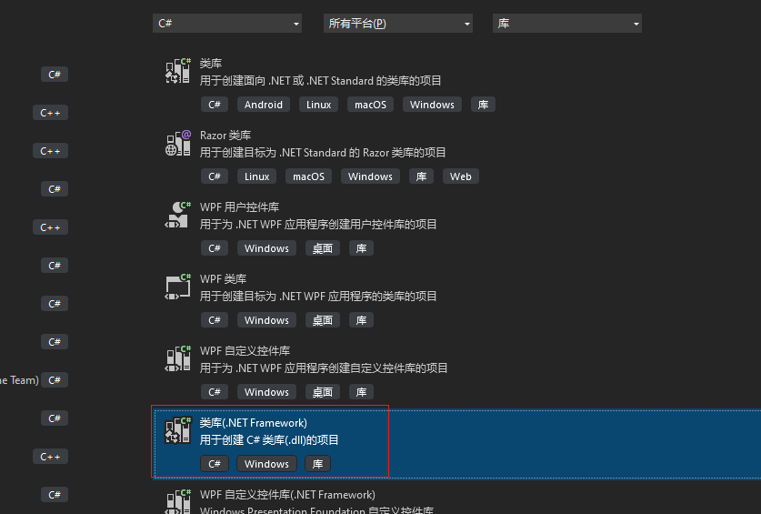

# 基础环境配置

## Celeste

> 如果你不是 Windows 用户的话这一步你可以直接跳过.

Everest 需求我们使用 FNA 版本的蔚蓝, 而 Linux 和 MacOS 上的蔚蓝已经就是 FNA 版本了, 而在 Windows 上则是 XNA 版本, 所以我们需要一些方法切换到 FNA 版本:

- 在 Steam 上:  库->Celeste, 右键菜单属性->测试版->Opengl
- 在 itch 上: 重新下载一个 `Celeste Windows OpenGL` 版本
- 在 Epic 上: 已经是 FNA 版本了

> Everest 会在运行时将你以 FNA 版本制作的 mod 重链接为 XNA, 所有你不是很需要在意这俩的差距  

> 注意更换版本后通常会变回原版, 记得重新安装 Everest


## C# 编程能力 与 开发环境

因为我们是 CodeMod, 嗯, 那么写一些代码是必不可少的, 那么一般情况在 IDE 里写代码会好很多.
蔚蓝是使用 `C#` 基于 `.NET framework 4.5.2` 制作的, 那么你就需要学习一下 `C#`.
> 理论上所有 .NET 系语言比如 VB.NET/F# 都可以, 但是为了方便起见我们使用 C#

好吧这句话可能说的太平淡了(, 毕竟大部分<del>蔚批</del>蔚蓝 mod 爱好者就是被这一步卡住的, 那我这里能做的... 只有给你推荐几个视频和书籍了.

对于通过视频的方式我推荐:  
[Bilibili 丑萌气质狗 【C#零基础入门教程 Visual Studio 2022】人生低谷来学C#](https://www.bilibili.com/video/av895726228)

对于书籍的方式我推荐:  
C#入门经典-第7版-C# 6.0  
> 如果你的能力无法支持正版的话, 你可以到上面视频up的群的群文件中寻找它的电子 pdf 版

对于开发使用的 IDE 这里推荐 `Visual Studio`, `Visual Studio Code`, `Rider`, 后两个是跨平台的而第一个是仅 Windows 平台的. 

- 对于 `Visual Studio`, 你需要安装 `.NET 开发负载`. (在`Visual Studio Installer`中)
- 对于 `Visual Studio Code`, 你需要安装 `C#` 拓展.

在之后我会在 `Windows` 上使用 `Visual Studio`, 其他编辑器/IDE就不会提了, 所以你遇到了什么奇怪的问题可以到任何能联系到我的地方问我_(:з」∠)_

## 项目创建

在vs创建项目页面中我们需要选择这个:  

  
注意要选带 `.NET Framework` 字样的, 蔚蓝的底层框架相对于目前的 `.NET` 已经很古老了, 所以可能会被稍微特殊点对待(, 之后在为项目命名的窗口中的项目框架记得精确选择 `.NET Framework 4.5.2`.  

  
如果你没有 [`.NET Framework 4.5.2`](https://dotnet.microsoft.com/zh-cn/download/dotnet-framework/thank-you/net452-developer-pack-offline-installer) 的选项请检查是否安装了此框架, 并且你选择的是带 `.NET Framework` 字样的类库项目.

当你创建完项目后, 你会得到一个代码文件 `Class1.cs`, 它看起来像:
```cs title="Class1.cs"
using System;
using System.Collections.Generic;
using System.Linq;
using System.Text;
using System.Threading.Tasks;

namespace MyCelesteMod
{
    public class Class1
    {

    }
}

```

## 添加对蔚蓝的引用

因为我们是蔚蓝 mod 嘛, 所以肯定得依赖一些蔚蓝的东西, 即依赖于蔚蓝的程序集.
具体操作来说:

- 在解决方案视图窗口你的项目下的`引用`上右击
- 选择`添加引用`
- 在新的窗口选择左侧的`浏览`
- 点击窗口右下角的`浏览`  
- 完成后在弹出的文件选择框中选择以下几个在蔚蓝根目录下的文件:
    - `Celeste.exe`
    - `FNA.dll`
    - `MMHOOK_Celeste.dll`
    - `YamlDotNet.dll`

> 对于 steam 版蔚蓝的目录通常会在 `C:\Program Files (x86)\Steam\steamapps\common\Celeste`

另外为了保证你的 mod 的跨平台性, 你的引用列表里 `System` 开头的只能包含:

- `System`
- `System.Configuration`
- `System.Core`
- `System.Data`
- `System.Drawing`
- `System.Runtime.Serialization`
- `System.Security`
- `System.Xml`
- `System.Xml.Linq`

如果你的项目引用有其他 `System` 开头系列的引用, 并且它们不在上述列表上, 你需要将其移除(右键->移除).

## 添加 Module 类

ok在我们一番折腾下我们终于可以开始来写代码了, 那么首先把你的 `Class1.cs` 重命名成 `(你的mod名)Module.cs`, 比如这里我的 mod 名叫 `MyCelesteMod`, 那么这个文件最好叫做 `MyCelesteModModule.cs`, 这是为了方便日后开发能一眼识别出这是我们最早期创建的那个关键类.

> 如果你的 vs 提示你是否重命名标识符, 你可以选是, 这样那个文件里的 `Class1` 类名也会帮你重命名

那么同样地对这个文件里的类的名字也重命名, 然后**我们让这个类继承于 `EverestModule`**.

> 如果出现了未命名标识符的错误, 请检查你是否正确引用了 `Celeste.exe` 并且 **using** 了 **`Celeste.Mod` 命名空间**

`EverestModule` 是一个抽象类 ,那么现在我们需要加入两个方法以实现它<del>, 同时让vs闭嘴</del>.
```cs title="MyCelesteMod.cs"
public override void Load()
{
}

public override void Unload()
{
}
```

`Load` 方法会在 Everest 加载你的 Mod 时被调用  
`Unload` 方法会在 Everest 卸载你的 Mod 时被调用  
在这里我们会写个类似 Hello world 的东西, 即在 `Load` 里打印些话. em, 可能不是你期望的 `Console.WriteLine` 而是 `Logger.Log`, 就像这样:

```cs
Logger.Log(LogLevel.Info, "MyCelesteMod", "Hello World! Hello Everest!");
```

这是一个蔚蓝底层框架 `Monocle` 引擎里的一个静态类, 在之后我们会介绍蔚蓝中常见类的使用, 在这里这个方法的参数:

- 第一个参数: 这句日志的等级, 这里我们先选 `Info`.
- 第二个参数: 这句日志的 `Tag`, 通常它是你的 Mod 名字
- 第三个参数: 我们希望输出的话

那么你现在的代码应该是大概这样子的:
```cs title="MyCelesteMod.cs"
using Celeste.Mod;
using System;
using System.Collections.Generic;
using System.Linq;
using System.Text;
using System.Threading.Tasks;

namespace MyCelesteMod
{
    public class MyModModule : EverestModule
    {
        public override void Load()
        {
            Logger.Log(LogLevel.Info, "MyCelesteMod", "Hello World! Hello Everest!");
        }

        public override void Unload()
        {
            
        }
    }
}

```

现在, 按下 `Ctrl + B`, vs 应该会启动编译.
> 你会遇到一个关于 `x86` 与 `AnyCpu` 架构不符的警告, 这里我们先忽略它并在后面解决.

编译完成, 我们就可以找到我们编译出来的新鲜的程序集: `<你的项目名>/<你的项目名>/bin/Debug/<你的项目名>.dll`, 你的 vs 的输出窗口也应该会写上这个 dll 的完整路径.

## 让 Everest 加载

以上一顿操作过后你会发现你的蔚蓝什么也没发生(乐). 因为我们还没告诉它让它加载我们的 mod! 为了让 Everest 加载我们的 mod, 其中一个方法就是在蔚蓝的 Mods 文件夹里面新建一个文件夹, 并放入我们的 mod 文件, 它的名字我们最好就是项目名字, 比如 `MyCelesteMod`, 然后在这里写一份 `everest.yaml` 文件, 它包含我们 mod 的一些基本信息:
```yaml title="everest.yaml"
- Name: <mod名字>
  Version: <版本>
  DLL: <dll位置>
  Dependencies:
    - Name: Everest
      Version: <依赖的 everest 版本>
```
ok, 我们来慢慢填这些东西
- `mod名字`: 推荐为项目名比如 `MyCelesteMod`
- `版本`: 由于是开发早期, 所以版本推荐指定为0开头的 `0.1.0`
- `依赖的 everest 版本`: 这里填你的 everest 版本就行了, 比如说如果你是 3876 那么这里应该写 `1.3876.0`
- `Dll 位置`: 我们先把之前编译的新鲜<del>(可能现在不咋新鲜了)</del>的 dll 复制到这个文件夹来, 没记错的话在这里叫 `MyCelesteMod.dll`, ok, `everest.yaml` 里要写的 dll 位置是相对于这个文件夹的, 我们就放在它里面第一层, 所以我们直接写 `MyCelesteMod.dll` 就行了.

现在你的那个文件夹现在可能长这个样子:

- MyCelesteMod
    * MyCelesteMod.dll
    * everest.yaml

everest.yaml可能长这个样子:
```yaml title="everest.yaml"
- Name: MyCelesteMod
  Version: 0.1.0
  DLL: MyCelesteMod.dll
  Dependencies:
    - Name: Everest
      Version: 1.3876.0
```

ok, 在启动之前我们还要干最后一件小事, 就是我们的日志, 它打印在文件里同时也打印在控制台里, 日志文件翻阅比较麻烦, 所以为了日后方便调试, 我们还是先让蔚蓝启动的同时启动一个控制台好一点. Everest 已经为我们做了这件事了, 我们要做的只是在蔚蓝exe同目录下找到`everest-launch.txt`, 没找到也没关系, 新建一个就可以了, 然后在里面写上`--console`, 是的就这一小点东西, 然后我们保存, 启动蔚蓝!

启动后你应该会同时看到一个控制台窗口, 扫视一下:
```log title="console output"
[MonoMod] [AutoPatch] Patch pass
[MonoMod] [AutoPatch] PatchRefs pass
[MonoMod] [PostProcessor] PostProcessor pass #1
[MonoMod] [Write] Writing modded module into output file.
(07/05/2023 23:22:16) [Everest] [Info] [MyCelesteMod] Hello World! Hello Everest!
(07/05/2023 23:22:16) [Everest] [Info] [core] Module MyCelesteMod 0.1.0 registered.
(07/05/2023 23:22:16) [Everest] [Info] [loader] Loading mods with unsatisfied optional dependencies (if any)
FNA3D Driver: D3D11
D3D11 Adapter: Intel(R) UHD Graphics 630
BEGIN LOAD
 - GFX LOAD: 139ms
 - MTN LOAD: 9ms
WINDOW-1600x900
GAME DISPLAYED (in 291ms)
 - AUDIO LOAD: 454ms
 - GFX DATA LOAD: 75ms
```
大概在如上的位置附近(在这里是第5行)你就能找到你的 Hello world 了, 至此基本环境配置结束.

最后修改: 2023-7-6