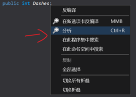

# 阅读代码

## 反编译工具

为了进行 Code Mod 的开发, 显然我们需要知道<del>看一眼就能被吓跑的</del>蔚蓝的代码是怎么运行的.

所以这时我们就需要**阅读蔚蓝的代码**以了解这些东西. 当然, 蔚蓝是个商业游戏, 想指望它开源所有代码是不可能的,
那我们就必须得借助一些反编译工具.  

在这里我会推荐 [`dnSpy`](https://github.com/dnSpyEx/dnSpy) 或 [`ILSpy`](https://github.com/icsharpcode/ILSpy)

!!! warning
    不要上传反编译后的代码到任何地方, 这可能会不可避免的造成一些争议.

### dnSpy

使用该软件很简单:

- 打开它
- 点击左上角的`文件`, `打开`
- 选择 `Celeste.exe` (如果你使用 Core 版本的 Everest, 你需要选择 `Celeste.dll`)
- 展开蔚蓝的程序集
- 你现在可以看到蔚蓝都有哪些类了
- 你现在也可以看到蔚蓝都有哪些函数了

现在我们浏览蔚蓝的代码就像你在 IDE 里浏览你的项目一样, 虽然这不是我们的项目. 在浏览过程中, 通常可能你会对着一个字段、一个函数发呆,
大概是因为你根本不知道它是做什么的!
好在 `dnSpy` 提供了一个很好用的"分析"功能来缓解这个 :  
  
在这里你可以看到哪些字段、哪些函数被谁调用了、被谁引用了、被谁更改了:
  

### ILSpy

使用该软件的方式与 `dnSpy` 相同:

- 打开它
- 点击左上角的`文件`, `打开`
- 选择 `Celeste.exe` (如果你使用 core 版本的 everest, 你需要选择 `Celeste.dll`)
- 展开蔚蓝的程序集, 浏览类和方法

相应的, `ILSpy` 也提供了"分析"的功能:

  
以及对应的分析结果(展开太长了就不展开了):

  

??? 分析结果说明
    因为 `ILSpy` 并没有实现分析结果的翻译, 这里做下简单的翻译:

    - `Uses` 直接依赖于
    - `Used By` 被调用于
    - `Read By` 被读取于
    - `Assigned By` 赋值于
    - `Expose By` 暴露于
    - `Instantiated By` 被实例化于
    - `Extension Methods` 拓展方法

## 反编译代码中的"特殊"语法

一些情况下, 阅读由反编译器生成的代码时可能不是那么顺利, 那么这一节会简单说一些反编译器生成的代码与通常的 C# 代码不一样的地方.

在反编译器中可能会出现这种奇怪的语法:
```cs title="Celeste.FinalBoss (即 6a 后半段 Badeline Boss 实体)"
public void orig_ctor(EntityData e, Vector2 offset)
{
    this..ctor(e.Position + offset, e.NodesOffset(offset), e.Int("patternIndex", 0), e.Float("cameraPastY", 120f), e.Bool("dialog", false), e.Bool("startHit", false), e.Bool("cameraLockY", true));
}
```

嗯...好的, 首先 `orig_ctor` 这个名字有点怪但是能接受, 但是接下来的 `this..ctor` 是什么? 它甚至在 `C#` 中是个非法语法!  
其实这并不罕见, 由于 Everest 对蔚蓝程序的修改并不只是停留在表面, 而更是深入到了 **IL 代码层**, 这是一种相对底层的代码,
你的 `C#` 代码最终**都**会被编译为 `IL` 然后扔给**运行时(runtime)**来执行, 同样地, 所有其他的 `.NET` 系语言比如 `VB.NET` 和 `F#` 也都会被编译为 IL.  
那么既然这里的 IL 是由 `C#` 编译而来的, 那么这样的 IL 多多少少会有一种 "C# 味", 反编译器就是靠这种一定的 "C# 味" 来逆推出可能的 `C#` 源码. 
但是既然这里 Everest 直接在 IL 代码层进行了修改, 破坏了这种 "C# 味", 那自然反编译器就会生成奇奇怪怪甚至非法的代码.  

那么这里生成的奇怪非法的代码是什么?  

### .ctor / .cctor

`.ctor` 是一个特殊的函数名称, 表示该类的**构造函数**, 比如 `Player..ctor(a, b)` 即表示调用 `Player` 类的 `.ctor` 函数, 虽然你自己是做不到的.  

`.cctor` 也是一个特殊的函数名称, 表示该类的**静态构造函数**, 比如 `Input..cctor()` 即表示调用 `Input` 类的无参静态构造函数.  

这一类函数在 `IL` 层有个标记叫 `special name`, 当反编译器发现一个方法名为 `.ctor` 且带有 `special name` 标记的方法时,
反编译器就会认为它是一个构造函数, 如果反编译器发现这个方法在一个构造函数开头调用了, 那么反编译器就会认为这个构造函数带一个构造函数链,
但是如果它的调用位置在其他位置, 同时又因为 `C#` 编译器是不可能这么编译的, 那么反编译器就会不知所措, 只能无奈的生成 `xxx..ctor()` 这种错误的语法.
这也是我们上面看到的 `this..ctor` 这种语法被生成的原因, 因为这个构造函数调用不在构造函数里出现, 而是在一个正常的 `orig_ctor` 方法里面!  

!!! info
    `ctor` 这个奇怪的缩写来自单词 `constructor`, 直译即 `构造器`.

所以我们通常也会用 `.ctor` / `ctor` 来指代构造函数, `.cctor` / `cctor` 指代静态构造函数. 此外, Visual Studio 中有个自带的代码片段就是 `ctor`,
在类中打出 ctor 并双击 Tab 键, vs 就会自动生成该类的构造函数, 这里的 `ctor` 来源也就在此. 

!!! info
    在后面的钩子节我们没有探讨过构造函数如何钩取, 在这里你可能就会明白, 钩取名字为 `ctor` 的函数就是钩取了构造函数, 静态构造函数同理.

### orig_*

还有一些函数以 `orig_` 开头, 这其实是 everest 自己"[钩取](../hooks/hook.md)"的函数. 在这里, 比如 `Player.Update` 方法就被 everest 进行了"钩取",
而钩子函数本体就是 `Player.Update`, 而对应我们钩子的 `orig` 委托在就体现为 `orig_Update` 方法.

```cs title="Player.Update  (像钩子本体一样!)"
public override void Update()
{
	this.orig_Update(); // 就像在我们的钩子里调用 orig 委托一样
    // 就像在我们的钩子里在函数执行完后做些事情一样
	Level level = base.Scene as Level;
	if (level == null)
    ......
}
// Player.orig_Update() 就像我们的钩子钩取的原函数!
```

!!! info
    如果你自行钩取 `Player.Update` 函数这种已被 everest "钩取" 的函数实际上你钩取的是 everest 的钩子, 这对于 `On` 钩子可能没有大影响,
    但是对于后面我们会说的 `IL` 钩子有很大影响, 不过这些我们等到后面再说.


