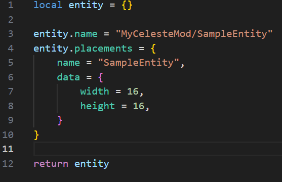
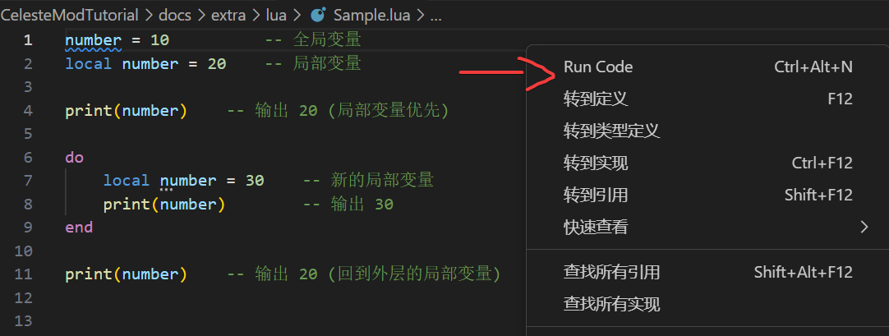
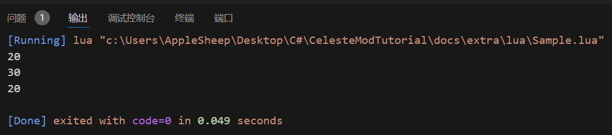

# Lua

## 前言

制图软件 `Loenn` 使用 `Lua` 作为开发语言. 相应的, 我们想要 `Loenn` 能加载到自定义实体也需要编写 `Lua` 脚本.

这个额外章节将会介绍<del>如何速通 Lua </del>一些编写 `Loenn` 侧自定义实体的加载脚本所必需的 `Lua` 知识.

!!!info
    本教程的内容基于 `LuaJIT 2.1`, 即 `Loenn` 底层引擎 `LOVE2D` 所使用的 `Lua` 版本.
    因此, 高版本与 `Loenn` 开发中不涉及的特性在此教程不会提及.
    如果对高版本 `Lua` 感兴趣可以阅读[官方文档](https://www.lua.org/manual/5.4).

## 开发环境

### Lua 安装
!!!info
    `Everest` 集成了 `Lua` 环境, 因此实际写蔚蓝 Mod 时可以直接使用其提供的 `Lua` API. 以下步骤仅用于学习或自定义开发时的 `Lua` 环境安装.

!!!info
    这部分介绍的是 Windows 系统下的 `Lua` 安装, Linux 用户可直接通过包管理器安装 `Lua`.

我们可以通过命令行工具 `winget` 安装 `Lua`:

!!!info 
    下面使用的是 `Windows PowerShell` 而不是 `cmd`. 某些命令行语法是 `Windows PowerShell` 独有的, 使用 `cmd` 可能会导致问题.

```bat
winget install DEVCOM.Lua
```

安装完成后, 我们可以通过以下命令检查 `Lua` 是否安装成功:
```bat
lua -v
```

如果命令行输出以下错误信息我们需要手动添加 `Lua` 的安装目录至系统环境变量:
```bat
lua : 无法将“lua”项识别为 cmdlet、函数、脚本文件或可运行程序的名称。请检查名称的拼写，如果包括路径，请确保路径正确，
然后再试一次。
```          

默认情况下, `winget` 会将 `Lua` 安装至 `%LocalAppdata%\Programs\Lua\bin`. 我们在命令行输入以下命令将 `Lua` 安装目录添加至系统环境变量中:
```bat
setx PATH "$env:PATH;%LocalAppdata%\Programs\Lua\bin\Programs\Lua\bin"
```

完成后我们可以再次检查 `Lua` 是否安装成功:
```bat
lua -v
```

安装成功会输出:
```bat
Lua 5.4.6  Copyright (C) 1994-2023 Lua.org, PUC-Rio
```

### Visual Studio Code 配置
这一步实际上是可选的, 不过为了更愉快的 `Lua` 脚本的编写,
个人还是觉得挺有必要的.  
在这里推荐使用 [Visual Studio Code](https://code.visualstudio.com/Download) 配上 [Lua (sumneko.lua)](https://marketplace.visualstudio.com/items?itemName=sumneko.lua)
插件:  


!!! note
    个人不太会配置这种 `Lua` 环境, 所以如果你遇到了大量的未定义警告你可以选择在设置中搜索 `Lua.diagnostics.enable` 并将其关闭.

此外, Lua (sumneko.lua) 插件并不支持 `Lua` 的运行. 个人推荐安装 [Code Runner](https://marketplace.visualstudio.com/items?itemName=formulahendry.code-runner) 插件.

安装完成后我们在右键菜单内点击 `Run Code` 即可运行 `Lua` 脚本:



运行结果将显示在输出窗口：

