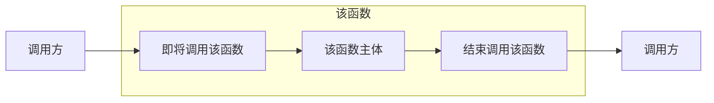
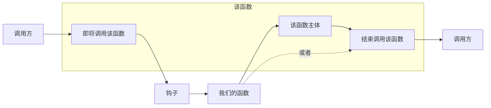
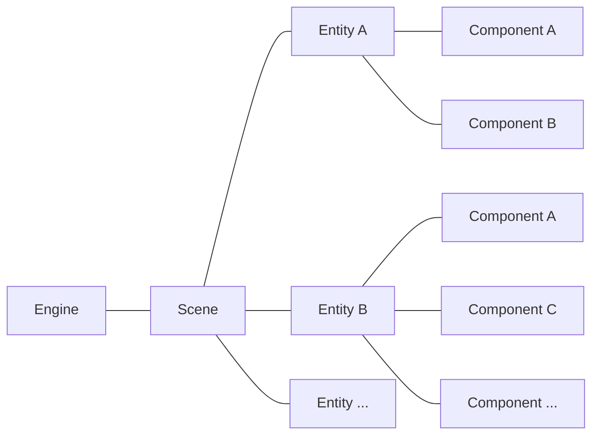

# 钩子, 阅读代码, demo1

<!--
- 原计划是自动化构建介绍于本节
- 考虑到使用模板配置更为简单所以以下这段内容就废弃了

## 开始之前

还记得我们是怎么编译我们的项目, 然后丢给 Everest 加载的吗?  
没事忘了也没关系, 我们在这里重新理一下:

- 编译我们的项目 (Ctrl + B, 或者菜单上的*生成*->*生成解决方案*)
- 找到编译出的程序集
- 复制到蔚蓝 Mods 目录下的你的 Mod 的文件夹下
- 在确保前面的步骤是在关闭蔚蓝时进行的后, 重新打开蔚蓝

看似简单的四步实际上真正操作起来是很麻烦的, -->

## 前言

在这一节, 我们会介绍在制作 mod 中的一个很重要的技术: 钩子(Hook),
我们主要介绍 On 钩子, 在之后我们会阅读蔚蓝的代码, 最后我们会制作一个修改玩家冲刺数的小 demo.

## 钩子 (特指 On 钩子)

对于 C# 的一个普通的函数来说, 它被调用时看起来是这样的:



当我们引入钩子技术后, 这个函数调用时会像被"钩"住一样转身去调用我们的函数:



如图所见, 该钩子允许你在调用某个函数时转身去调用我们的函数, 同时你能选择我们的函数执行完后是否再执行回原函数.

在 Everest 中, 借助于 MonoMod 的技术, 创建一个 On 钩子简单的就像:

```cs title="简单的钩取..."
public override void Load()
{
    On.Celeste.Player.Update += Player_Update;
}

private void Player_Update(On.Celeste.Player.orig_Update orig, Player self)
{
    orig(self);
}

public override void Unload()
{
    On.Celeste.Player.Update -= Player_Update;
}
```

在上面的代码中我们使用类似订阅事件的语法去钩住了 `Player` 类的 `Update` 方法(该方法每帧都会调用一遍),
Everest 为我们把几乎所有可能钩取的函数放到了命名空间 `On` 中, 当你想钩取某个方法时只需通过 `On` 命名空间一路"点"到你想要的方法上,
然后使用一个钩子函数以像事件一样的语法"订阅"就能钩住它!
在这里我们的钩子函数就是`Player_Update`,
你可能注意到参数很复杂, 是的, 所以一般来说我都是依赖 IDE 帮我自动填写这些参数就像:  

  
  


!!! note
    注意 IDE 生成的函数默认包含一句抛出异常语句, 记得把它改掉

`orig` 参数是一个**委托**, 调用它就相当于调用这个钩子钩住的原函数, 也就是说你可以在该函数调用前做些事,
也可以在该函数调用后做些事, 或者干脆不调用这个函数, 甚至调用这个函数多次.
通常来说我们都会在末尾简单的调用回去避免造成不必要的麻烦.

```cs title="一些钩子本身..."
private void Player_Update(On.Celeste.Player.orig_Update orig, Player self)
{
    // 在这之前做一些事...

    // 当某些奇怪的条件不成立时我们才调用回去原来的函数...
    if (!xxx)
        orig(self);

    // 在这之后做一些事...
}
```

如果你钩取到的是一个成员函数(也叫成员方法), 那么参数通常会带有一个 `self`, 它表示执行这个成员函数时 `this` 的值,
那么自然地如果你钩取的是一个静态函数那么是没有这个参数的.  
如果你钩取的函数是带参数的, 那么参数列表会原封不动的排列在前面提到的参数的后面.  

比如你尝试钩取 `Player.Jump` 函数时, 它的三个参数会这样传递给你:

```cs
private void Player_Jump(On.Celeste.Player.orig_Jump orig, Player self, bool particles, bool playSfx)
```

最后, **不要忘记**在 `Unload` 方法里**取消**掉我们的钩子(通过`-=`), 防止我们的钩子在不必要的地方产生不好的影响:
```cs title="取消钩子"
public override void Unload()
{
    On.Celeste.Player.Update -= Player_Update;
}
```

### Monocle, EC 架构

在这里我会简单介绍一下整个蔚蓝是怎么组织起来的.  
首先蔚蓝基于 `Monocle` 引擎, 这是 `matt` 自己开发的一个引擎, 所以别指望你能在网上找到它的教程(,
其次 `Monocle` 再次依赖 `XNA` (已停止维护) 或者 `FNA` (`XNA` 框架的重新实现),
`XNA` 提供的 api 都非常原始, 甚至连最基本的场景组织之类的都没有, 那么 `Monocle` 就是来实现这些的.  

通常来说一个正在运行的 `Monocle` 游戏的结构就像:


- `Scene` 表示一个场景, 比如主界面场景, pico8 场景, 以及最常见的 gameplay 场景.  
- `Entity` 表示一个实体, 比如说玛德琳就是一个实体, 一个弹球是一个实体, 一个泡泡是一个实体.
- `Component` 表示一个组件, 它附加与实体之上, 通常我们能直接看到的只有图片组件, 比如岩浆块的贴图就是由 `Image` 组件来展现的, 玩家的动画由 `Sprite` 组件展现.  

!!! info
    以上这个架构我们就称为 `EC` 架构, 它是游戏的一种组织方式的实现.  

通常地, 每过 `1/60` 秒, `Engine` 就会被调用它的 `Update()` 函数用来更新游戏逻辑,
`Engine.Update()` 内部会再次调用 `Scene` 的 `Update()` 函数,
`Scene.Update()` 内部会遍历它所有的 `Entity` 并调用它们的 `Update()` 函数,
`Entity.Update()` 内部还会遍历它所有的 `Component` 并调用它们的 `Update()` 函数.  

那么自然, `Player.Update()` 就是玛德琳每帧的更新逻辑所在的地方了. 现在我们做一个小 demo, 将玩家的冲刺数量锁死为单冲.  

## 锁定单冲

通过简单的浏览蔚蓝的代码, 你了解到(没了解到也正常, 后面会说一些常见类和结构帮助你理解) `Player.Dashes` 这个字段储存了玩家的冲刺数量, 那么现在我们将它锁定为 1, 也就是单冲.  
首先我们钩取 `Player.Update()`, 然后在确保调用回原来的函数后直接将 `Dashes` 强制修改为 1.

```cs title="锁定冲刺为1!"
public override void Load()
{
    On.Celeste.Player.Update += Player_Update;
}

private void Player_Update(On.Celeste.Player.orig_Update orig, Player self)
{
    self.Dashes = 1;
    orig(self);
}

public override void Unload()
{
    On.Celeste.Player.Update -= Player_Update;
}
```

那么现在编译, 按之前的内容操作, 并重启蔚蓝, 你应该就会看到你的玛德琳永远都会有单冲了(即使是在空中!).

## 钩子的最佳实践

我们应该尽可能一次性地就将我们所需要的所有钩子在 `Load` 里加载完, 因为创建钩子实际上的开销并不小,
如果你需要某些 "某些条件不成立不启动钩子, 条件成立再启动钩子" 的逻辑的话, 我建议你应该始终保持钩子,
然后在钩子内部判断你的条件, 不成立时你应该直接回调原来的方法并不做任何其他事情.