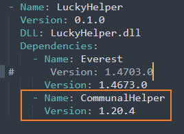
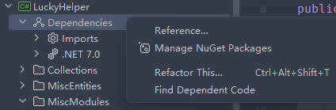

# IL 钩子与随意钩取

## IL 钩子

### 插入 IL

现在, 你已经了解了基本的 IL 知识, 稍微会使用 `System.Reflection.Emit` 库了, 那么我们就可以开始使用 IL 钩子了. IL 钩子允许你**修改**蔚蓝的代码,
这是一个很强大的功能, 那么自然而然, 它的使用也会变得更加复杂.  

IL 钩子与 On 钩子的事件订阅方式很相像, 只不过是换成了 IL 命名空间, 不过要注意的是, 方法的参数不再是原函数委托加上其对应参数了, 而是一个 `ILContext` 类型的值,
同时, 方法也不是每次调用被钩方法时调用, 而是仅在游戏启动时调用. 例如, 钩取玩家的 `SuperWallJump` 方法(在玩家做出了一个蹭墙时调用):

```cs
public override void Load()
{
    IL.Celeste.Player.SuperWallJump += Player_SuperWallJump;
}

private void Player_SuperWallJump(ILContext il)
{
    
}

public override void Unload()
{
    IL.Celeste.Player.SuperWallJump -= Player_SuperWallJump;
}
```

现在, 我们获取到了一个 `ILContext`, 它表示这个方法的 `IL` 上下文, 不过在这里你不需要知道这是什么, 我们通常要的只是使用其创建一个 `ILCursor`:

```cs
ILCursor cur = new(il);
```

顾名思义, 这是一个 "IL 指针", 它 "指向" 这个方法的 IL 代码的某一行, 它拥有很多方法以允许我们在它指向的位置下添加, 修改, 删除 IL, 自然,
它也带有很多方法来移动它的指向, 最常用的方法之一是 `TryGotoNext`, 它的参数列表包含一系列的 `predicates`(这词似乎没个统一的翻译, 不过理解它很简单).  

现在, 假设我们的目的是修改玩家蹭墙跳时的竖直速度为 2 倍, 那么我们找到 `SuperWallJump` 方法, 注意到竖直速度是在这里设置的:

```cs title="Celeste.Player.SuperWallJump()" hl_lines="5"
...
this.wallSlideTimer = 1.2f;
this.wallBoostTimer = 0f;
this.Speed.X = 170f * (float)dir;
this.Speed.Y = -160f;
this.Speed += this.LiftBoost;
this.varJumpSpeed = this.Speed.Y;
this.launched = true;
...
```

那么我们查看它附近 IL, 然后查找这部分 IL 的一个特征以方便我们进行定位:

<!--没 il 的高亮, 但是注意到 asm 的高亮挺适合的, 所以(-->
```asm title="Celeste.Player.SuperWallJump()" hl_lines="7"
IL_0075: ldarg.1
IL_0076: conv.r4
IL_0077: mul
IL_0078: stfld     float32 [FNA]Microsoft.Xna.Framework.Vector2::X
IL_007D: ldarg.0
IL_007E: ldflda    valuetype [FNA]Microsoft.Xna.Framework.Vector2 Celeste.Player::Speed
IL_0083: ldc.r4    -160
IL_0088: stfld     float32 [FNA]Microsoft.Xna.Framework.Vector2::Y
IL_008D: ldarg.0
IL_008E: ldarg.0
```

我们发现这里有一个很特殊的 -160 浮点数的压入, 并且紧随其后的是一个 `Vector2::Y` 字段的存入, 那么这样我们就可以使用这个特征将 IL 指针指向这里:

```cs
if (cur.TryGotoNext(ins => ins.MatchLdcR4(-160f), ins => ins.MatchStfld<Vector2>("Y")))
{
    // 指针位于 ldc.r4 指令了
}
```

上述代码中我们要求 IL 指针向下查找, 直到找到一个位置使得 IL 是 `ldc.r4 -160f` 并且下一行是储存到 `Vector2` `Y` 字段. 如果没找到则返回 `false`.  
现在, 我们的指针已经指向 `ldc.r4` 了, 但是此时在这个位置加入 IL 代码实际上会加到这一行上面去, 所有我们得先让它再向下移动一行, 然后使用我们的 IL 知识, 将它乘以个 2:
```cs
if (cur.TryGotoNext(ins => ins.MatchLdcR4(-160f), ins => ins.MatchStfld<Vector2>("Y")))
{
    cur.Index++;
    cur.Emit(OpCodes.Ldc_R4, 2.0f);
    cur.Emit(OpCodes.Mul);
}
```

!!! warning
    注意 OpCodes 位于 `Mono.Cecil.Cil` 而不是 `System.Reflection.Emit` 命名空间下.

现在编译运行, 你应该能观察到蹭墙跳的竖直速度变的很大!  

注意的是, IL 钩子很强大, 但使用它的风险也很大, 稍有不慎就会使整个游戏直接崩溃. 例如, 在上面的代码中, 如果你忘记了向下移动一行,
我们希望插入的 IL 代码就会错误地被插入至 ldc.r4 的上一行, 通常这会导致非法的 IL 以导致 JIT 编译异常, 或者其他不可预知的行为,
不过在这里它会导致一个更加严重的问题, 它会直接崩溃掉你的游戏并且不加任何 log.txt 的输出和 error_log.txt 的弹出!
你可以自己尝试一下来感受如果 IL 钩子使用失误的情况.  

通常更常见地, 我们希望这个系数是可以随时修改的, 相信你很快就能想到比如储存到字段里, 然后插入一些复杂的字段读取代码或者复杂的方法调用代码,
不过 MonoMod 为我们提供了一个更简单的方法: `EmitDelegate`, 它能一键生成这些复杂的方法获取和调用.  

例如你有一个静态方法 `GetFactorOfWallJumpYSpeed`, 它会根据一些情况返回不同的值, 例如在这里检测按跳时是否同时按下抓键, 是则翻倍竖直速度, 否则不变:

```cs
public static float GetFactorOfWallJumpYSpeed()
{
    if (Input.Grab.Pressed)
        return 2.0f;
    else
        return 1.0f;
}
```

上面对应的代码:

```cs
if (cur.TryGotoNext(ins => ins.MatchLdcR4(-160f), ins => ins.MatchStfld<Vector2>("Y")))
{
    cur.Index++;
    // as easy as pi!
    cur.EmitDelegate(GetFactorOfWallJumpYSpeed);
    cur.Emit(OpCodes.Mul);
}
```

### 移除 IL

通常除了插入, 我们还需要移除 IL, 对于修改 IL 的情况我们只需要先移除再插入即可.  
要移除一行 IL, 我们可以使用 `Remove` 方法, `Remove` 方法会移除指针所指的 IL 行, 例如我们依然修改玩家的蹭墙跳竖直速度, 但是在这里我们直接覆盖我们的新值:

```cs
if (cur.TryGotoNext(ins => ins.MatchLdcR4(-160f), ins => ins.MatchStfld<Vector2>("Y")))
{
    // 注意没有 cur.Index++ 了, 记住 Emit 时新代码被添加到上一行, 而 Remove 时则移除当前行
    cur.Remove();
    // 当前一行的 IL 已经被移除了, 现在指针实际上指向之前的下一行, 所以我们可以直接 Emit
    cur.Emit(OpCodes.Ldc_R4, -300.0f);
}
```

!!! note
    在插入 IL, 修改 IL, 更改 IL 指针指向时务必清楚插入位置, 删除目标, 以及操作完成后的指针指向.

## 任意钩取

相信你已经发现了, 有些方法比如叫做 `orig_xxx` 的方法, 以及属性的 getter 和 setter 你都无法在 On.* 和 IL.* 这两个命名空间中找到,
同时, 钩取别的 helper 的方法似乎也无法完成.  

这里我们引入两个新类: `Hook` 与 `ILHook`, 前者表示一个 On 钩子, 后者表示一个 IL 钩子.

!!! info
    `Hook` 与 `ILHook` 位于 `MonoMod.RuntimeDetour` 程序集中, 在旧模板里它没有被默认引用进来, 这是一个我个人的失误,
    如果你确实无法引用这两个类的话你可以在 `CelesteMod.props` 里的最底下的那个 `ItemGroup` 中加入这一条:
    ```xml
    <Reference Include="MonoMod.RuntimeDetour">
		<HintPath>$(CelesteAssemblyPath)/MonoMod.RuntimeDetour.dll</HintPath>
		<Private>False</Private>
    </Reference>
    ```

`Hook` 的构造函数拥有非常多重载, 在这里我们只需要那个 `(MethodBase method, Delegate to)` 的重载,
它表示我们希望钩取第一个参数指定的方法, 钩子方法是第二个参数指定的委托.  

例如, 我们希望钩取 `Player.Inventory` 这个属性的 `get` 方法, 使其总是返回 `PlayerInventory.TheSummit`,
也就是总是具有背包, 双冲等:

```cs
// 储存我们的 hook, 以便我们在 Unload 中释放它
private Hook playerInventory_get_hook;

public override void Load()
{
    // 先使用反射找到 Player.Inventory 属性的 getter
    var playerInventory_get = typeof(Player).GetProperty("Inventory").GetGetMethod();
    // 使用其创建一个 On 钩子
    playerInventory_get_hook = new(playerInventory_get, PlayerInventoryHook);
}

// 我们需要手动声明 orig 方法的委托, 因为这里不再是方便的事件订阅了
public delegate PlayerInventory PlayerInventory_get_orig(Player self);
public static PlayerInventory PlayerInventoryHook(PlayerInventory_get_orig orig, Player self)
{
    // 直接忽略 orig 方法的调用, 强制返回 7a/b/c 的 Inventory
    return PlayerInventory.TheSummit;
}

public override void Unload()
{
    // 记得销毁钩子
    playerInventory_get_hook.Dispose();
}
```

因为不再是之前方便的事件订阅, 所以钩子的 orig 参数的委托原型你必须得自己声明, 注意钩子方法和钩子 orig 参数的参数列表一定要小心准确的填写,
否则会直接造成游戏崩溃. 上述代码的效果应该是你无论如何都会拥有 7a/b/c 的 Inventory, 也大概即双冲, 带背包.  

现在, 拥有了钩子函数, 你可以做任何你之前使用订阅事件来创建钩子一样的事. 顺便, 使用这种方法也允许你钩取别的 helper 的方法,
甚至是钩取别的 helper 的钩子方法. 不过在此之前你需要为你的 mod 声明依赖或者可选依赖, 声明可选依赖后又需要检测对应 mod 是否加载等等,
这部分内容我们之后再说.  

同样地, IL 钩子的创建也与 On 钩子相同:

```cs
private ILHook playerInventory_get_ilhook;

public override void Load()
{
    var playerInventory_get = typeof(Player).GetProperty("Inventory").GetGetMethod();
    playerInventory_get_ilhook = new(playerInventory_get, PlayerInventoryILHook);
}

public static void PlayerInventoryILHook(ILContext context)
{
    // 像之前一样做你在 IL 钩子中做的事...
}

public override void Unload()
{
    playerInventory_get_ilhook.Dispose();
}
```

不过不再需要手动声明 orig 委托, 因为 IL 钩子的钩子方法参数列表是固定的.

!!! note
    关于协程函数的钩取与上述步骤截然不同, 这一点我们会在下一节探讨.


钩取其他helper(参考[Everest Wiki](https://github.com/EverestAPI/Resources/wiki/Cross-Mod-Functionality))

首先我们在钩取前需要确保对应helper已加载, 所以得在`everest.yaml`文件里填上对应依赖, 这样Everest就会先加载依赖, 然后再加载我们的dll, 接下来我将以`CommunalHelper`里的`Chain`实体为例钩取它的的`Update`(选这个是因为在Loenn里随便翻了下发现这个名字比较短, 注意放置的时候挂在Solid(例如前景砖)对象下, 不然它会自己删除自己, 看不到效果)



然后在你的Module类里模仿如下代码即可(不要管特性, static什么的, 把load unload函数体里的内容照猫画虎写一下即可)
```csharp
using System.Reflection;
using LuckyHelper.Module;
using MonoMod.RuntimeDetour;

namespace LuckyHelper.MiscModules;

public class TestModule
{
    private static Hook chainUpdateHook;  // 钩子

    private delegate void chainUpdateHookDelegate(Entity self);  // 调用Chain.Update的委托

    [Load]
    public static void Load()
    {
        EverestModuleMetadata communalHelper = new()  // communalHelper的信息
        {
            Name = "CommunalHelper",
            Version = new Version("1.20.4")
        };
        
        if (Everest.Loader.TryGetDependency(communalHelper, out EverestModule communalModule))  // 拿到communalHelper的Module
        {
            Assembly communalAssembly = communalModule.GetType().Assembly;  // 拿到communalHelper的程序集
            Type chain = communalAssembly.GetType("Celeste.Mod.CommunalHelper.Entities.Chain");  // 拿到Chain的Type
            MethodInfo method = chain.GetMethod("Update", BindingFlags.Instance | BindingFlags.Public);  // 拿到Update函数
            chainUpdateHook = new Hook(method, ChainOnUpdate);
            // Logger.Log(LogLevel.Info, "Test", "HookChainOnUpdate OK");
        }
    }

    private static void ChainOnUpdate(chainUpdateHookDelegate orig, Entity chain)
    {
        orig(chain);
        // 做一些事
        // Logger.Log(LogLevel.Info, "Test", "123");
    }

    [Unload]
    public static void Unload()
    {
        chainUpdateHook.Dispose();
    }
}
```

但是这么写就很难受, 而且chain的类型为Entity不为Chain了, 想类型转成Chain我们又拿不到Chain, 这时就需要我们在IDE里添加`CommunalHelper`的Dll依赖(像一开始配置蔚蓝code环境那样)



接下来有两种方法获取依赖

方法一

dc 社区习惯的做法是将这个 dll 的 ref 版本 (stripped 后的版本, 即删除所有方法的实现, 只保留元数据) 放到 mod 目录外面的 lib-stripped 目录里然后引用. 参考[草莓酱](https://github.com/StrawberryJam2021/StrawberryJam2021/tree/main)的源码.

那么我们该如何strip dll呢: 先下载[Mono](https://www.mono-project.com/download/stable/), 然后打开`Open Mono x64 Command Prompt`(一个命令行程序), 输入`mono-cil-strip 原dll路径 strippedDll路径`即可, 大概类似这样`mono-cil-strip C:\Users\你的用户名\Desktop\CommunalHelper.dll C:\Users\你的用户名\Desktop\CommunalHelperStripped.dll`

方法二

"我"个人习惯直接引用 Mods/Cache/xxx.xxx.dll 这里的 dll, 新模板加了个 CelesteModReference 这个 Item, 往 ItemGroup 里加一条 <CelesteModReference Include="FrostHelper" AssemblyName="FrostTempleHelper"/> 就会自动引用, 但我没啥时间写这个了(


代码看上去长这样
```csharp
using System.Reflection;
using Celeste.Mod.CommunalHelper.Entities;
using LuckyHelper.Module;
using MonoMod.RuntimeDetour;

namespace LuckyHelper.MiscModules;

public class TestModule
{
    private static Hook chainUpdateHook;

    private delegate void chainUpdateHookDelegate(Chain self);

    [Load]
    public static void Load()
    {
        EverestModuleMetadata communalHelper = new()
        {
            Name = "CommunalHelper",
            Version = new Version("1.20.4")
        };
        bool isLoaded = Everest.Loader.DependencyLoaded(communalHelper);
        if (isLoaded)
        {
            chainUpdateHook = new Hook(typeof(Chain).GetMethod("Update"), ChainOnUpdate);
        }
    }

    private static void ChainOnUpdate(chainUpdateHookDelegate orig, Chain chain)
    {
        orig(chain);
        Logger.Log(LogLevel.Info, "Test", "123");
    }

    [Unload]
    public static void Unload()
    {
        chainUpdateHook.Dispose();
    }
}
```