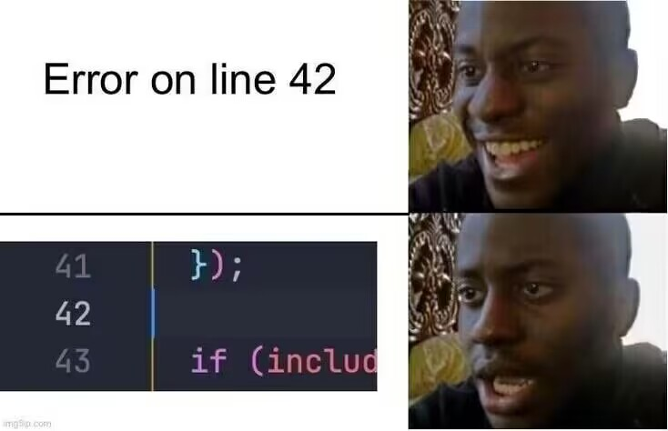
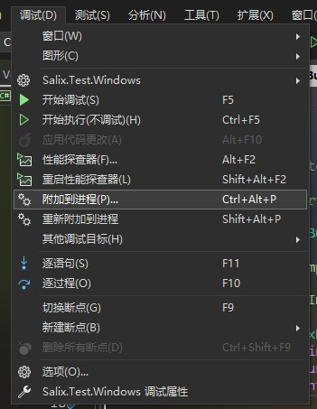

# Debug调试

只要写程序就免不了bug, 所以我们需要强有力的debug手段

最常见的debug手段是通过 `Logger.Log()`, 能解决大部分问题, 但当项目做大, 嵌套变多, `Logger` 输出的信息已经满足不了我们的时候(甚至我们都不知道这个 bug 哪儿来的), 我们一般就要使用断点来调试, 步骤如下:

1. 打开蔚蓝
2. 在你的IDE上debug选项附近选择**附加到进程**, 然后选择蔚蓝
    *  VisualStudio
   
    *  Rider
   
3. 接着在旁边打上红红的断点
   
4. 然后当 `madeline` 碰到 `PassByRefill` 的时候, 游戏进程就会被锁住, 接着你可以通过步进, 步入, 步出等方式进行调试, 获取想要的信息
5. 调试完成后, 你可以直接停止调试, 或者把断点点掉然后点击"恢复程序运行", 之后再打上断点继续调试