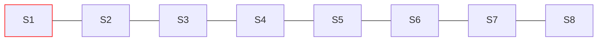
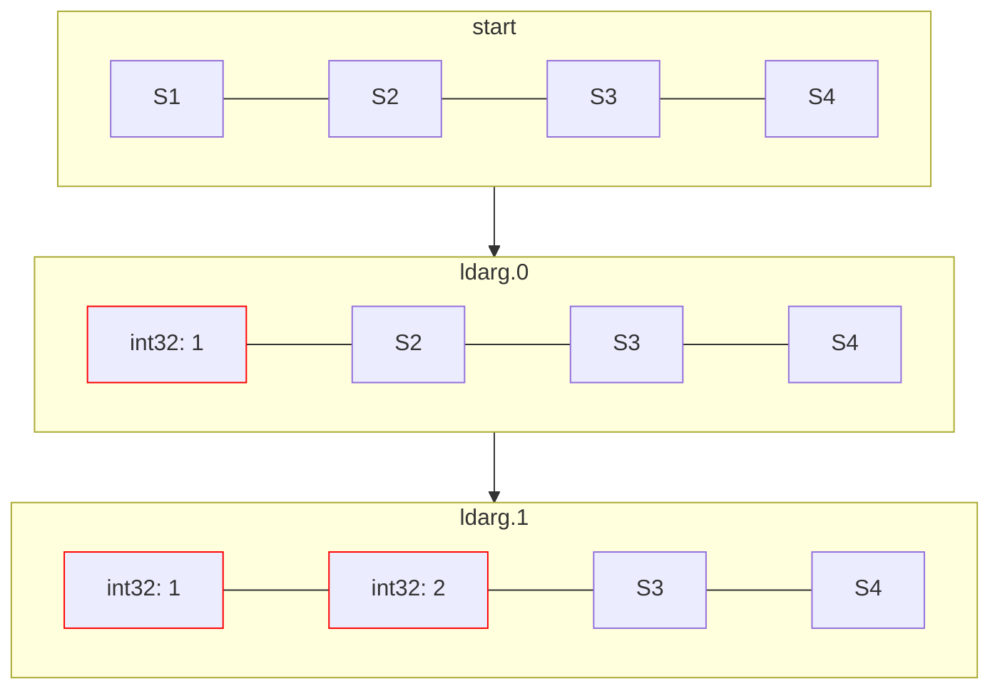
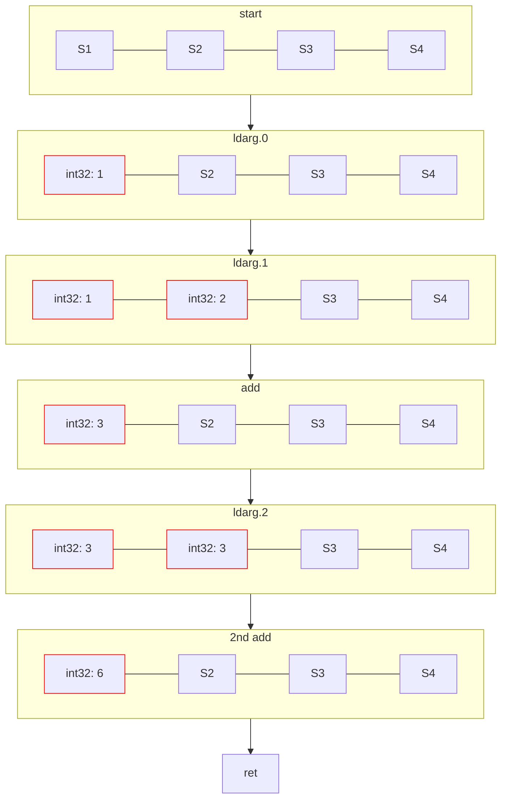

# IL

!!! info
    如果你在之前已经学习过 `IL` 并且使用过类 `System.Reflection.Emit` 这些 api 的话你可以跳过这一节.

## 简介

`IL` 全称 `Intermediate Language`, 在一些较老的文档里面它可能也会被叫做 `MSIL`, 即 `Microsoft Intermediate Language`.  
在前面我们就已经提到过 `IL` 了([阅读代码2](../begin/reading_2.md)), 但是并没有深入的讲解它到底是什么样的.  
`IL` 通常来说可以理解成两个部分, 一个 "执行" 部分, 一个 "声明" 部分, "执行" 部分规定了一个函数内部的代码应该怎么操控我们的程序,
而 "声明" 部分则规定了一个函数的返回值, 参数列表, 访问修饰符, 所在类, 类的访问修饰符, 名称等这些**元数据**, 获取这些元数据其实你早在学习**反射**的时候就进行过.
同时*修改或生成这些元数据*也不困难, 但是在进行蔚蓝 modding 时*修改或生成这些元数据*的操作几乎不会被使用到,
所以这一节我们聚焦于 `IL` 的 "执行" 部分, 讲述其基本结构, 基础语法等内容.  

## 初印象

```cs title="HelloWorld!"
namespace DynamicAssemblyTest;

public static class Program
{
    public static void Main()
    {
        Console.WriteLine("Hello world!");
    }
}
```
现在, 试着编译上述很简单的 HelloWorld 程序, 找到其程序集, 然后用 `dnSpy`(或者 `ILSpy` 也行) 打开它.  
不过这次我们不是在看 `C#` 代码了, 我们需要看 `IL` 代码, 所以我们在如下图的这个下拉框中选择 `IL`:


在图中的那一坨你可能不知所措的代码就是 `IL` 代码了, 在上述 `IL` 代码中 `.method` `.class` 这一类字样就表示声明一个 方法/类,
而其后面所跟的一大长串关键字就是一些元数据, 比如类名, 访问修饰符等我们之前谈论过的东西, 后面的大括号就表示这个声明的 "内容物",
通常类的 "内容物" 有内部类, 方法, 构造器, 字段, 属性等, 那么显而易见这里就毫无疑问就是 `IL` 的声明部分了.  
现在我们关注 `.method` 声明, 其的 "内容物" 就是我们接下来要聚焦的, 即 `IL` 的 "执行" 部分.
在上图中 dnSpy 帮我们将前面加上了字节内存偏移的那每一行就是我们的 `IL` 代码了,
不过这里我们不太会需要这个偏移量, 因为大多数涉及操作 `IL` 的库都会为我们自动完成这个偏移的计算.

## 切换环境 & 动态程序集

现在我们需要一个环境来书写我们的 `IL` 代码, 当然你虽然完全可以就在 dnSpy 对着那一大堆 `C#` 编译后的 `IL` 进行修改, 
并频繁保存修改然后运行来查看效果, 但是这总归没有我们直接在 `C#` 代码里写 `IL` 代码里方便!

首先, 我们现在可以不再在 mod 工程里工作了, 这部分内容是独立开来的, 所以我会推荐你新建一个项目来做这些.  
这里我给项目取的名是 `DynamicAssemblyTest`, 目标框架是 `.net 7`.  
完成后, 复制粘贴以下代码(之后我们会慢慢解释的):
```cs hl_lines="22-24"
using System.Reflection;
using System.Reflection.Emit;

namespace DynamicAssemblyTest;

public static class Program
{
    public static MethodInfo GenerateMethod(Action<ILGenerator> generateAction)
    {
        AssemblyBuilder asmBuilder = AssemblyBuilder.DefineDynamicAssembly(new("MyAssembly"), AssemblyBuilderAccess.RunAndCollect);
        ModuleBuilder moduleBuilder = asmBuilder.DefineDynamicModule("MyTestModule");
        TypeBuilder typeBuilder = moduleBuilder.DefineType("MyType");
        MethodBuilder methodBuilder = typeBuilder.DefineMethod("MyMethod", MethodAttributes.Public | MethodAttributes.Static);
        generateAction(methodBuilder.GetILGenerator());
        return typeBuilder.CreateType().GetMethod("MyMethod")!;
    }

    public static void Main()
    {
        MethodInfo methodInfo = GenerateMethod(il =>
        {
            il.Emit(OpCodes.Ldstr, "Hello Dynamic Method!");
            il.Emit(OpCodes.Call, typeof(Console).GetMethod("WriteLine", new Type[] { typeof(string) })!);
            il.Emit(OpCodes.Ret);
        });
        Action action = methodInfo.CreateDelegate<Action>();
        action();
    }
}
```
!!! note
    我默认启用了隐式命名空间, 如果你遇到了类型未找到的报错那你就得手动 using 一下剩余的那些命名空间了.

现在运行你的程序, 你应该会得到一句输出: `Hello Dynamic Method!`.  
上述代码其实是在在代码中动态定义了一个程序集, 然后动态定义了一个类, 并向里面动态定义了一个 `MyMethod` 方法,
之后我们动态地 "编译" 了这个程序集并将其装载到我们的程序集域中, 其中,
`MyMethod` 方法的 `IL` 的内容就是在我们的 `Main` 方法中 `GenerateMethod` 参数中的委托定义的.  
往简单来说就是我们在代码中反射创建了一段新的代码并执行, 这听起来是不是酷极了?  
上面这个动态定义程序集的库叫做 `System.Reflection.Emit`, 在这里我们只是为了学习一点 `IL` 知识而使用,
到后面修改蔚蓝的程序集时我们需要使用 Everest 带的 `Mono.Cecil` 库, 不过他们大同小异.

## 基本 `IL`

<!-- mkdocs 似乎没有为 IL 代码的高亮 -->
```c
IL_0000: nop
IL_0001: ldstr     "Hello world!"
IL_0006: call      void [System.Console]System.Console::WriteLine(string)
IL_000B: nop
IL_000C: ret
```

通常来说, 一段 `IL` 包含多行 `IL`, 每一行 `IL`(我偶尔也会称为一句 `IL`) 都包含一个**操作码(OpCode)**以及可以没有的参数.  
比如上述段 `IL`, 其包含五行 `IL`:

- 第一行 `IL` 的操作码是 `nop`, 没有参数
- 第二行 `IL` 的操作码是 `ldstr`, 参数是一串字符串, 或者严谨的说, 是一个字符串的 `token`, 它引用了程序集元数据中存放字符串本体的位置, 
不过我们可以忽略这个细节, 因为我们不会涉及到 `IL` 的具体字节层面的东西.
- 第三行 `IL` 的操作码是 `call`, 参数是一个方法, 它也是一个 `token`, 其也是引用了元数据中存放方法本体的位置
- 第四行 `IL` 的操作码是 `nop`, 没有参数
- 第五行 `IL` 的操作码是 `ret`, 没有参数

那么, 在知道 `IL` 的基本结构后, 我们就可以具体学习 `IL` 这些操作码到底干了什么了.

## 评估栈

!!! note
    如果你在这里不知道栈是什么的话, 你就该去复习一下你之前学习的数据结构之**栈**了.

在 `IL` 代码中, 大量操作符本质上都是在操作一个叫做 `评估栈` 的东西,
从字面上我们就可以知道它是一个栈, 那么既然是栈, 那么通常就有 `压入` 和 `弹出` 两种操作,
`评估栈` 也是如此.  
比如如下 `C#` 方法:
```cs
static int Add(int a, int b, int c) 
{
    return a + b + c;
}
```

它在编译器的 `Release` 优化下会编译成如下 `IL`:
!!! info
    编译器的 `Debug` 编译下会产生很多用于调试代码的 `IL`, 相对来说会复杂很多, 所以我们使用 `Release` 编译来尽可能简化

```c
.method private hidebysig static 
		int32 Add (
			int32 a,
			int32 b,
			int32 c
		) cil managed 
	{
		.maxstack 8

		IL_0000: ldarg.0
		IL_0001: ldarg.1
		IL_0002: add
		IL_0003: ldarg.2
		IL_0004: add
		IL_0005: ret
	} // end of method Program::Add
```

这里我们把一部分声明部分放出来了, 不过我们只需要关心这一行: `.maxstack 8`, 它表示请求在这个方法执行过程中评估栈有确保 8 个大小的空间可以使用.
用图表的方法大概是(最左侧栈高度最低, 向右栈高度逐渐增加, 红色表示目前使用了的栈位, 之后的图表同):

<center>

</center>

首先我们会介绍一个系列的操作符 `ldarg.*`, 它表示将方法参数列表中的第 *-1 个参数压入评估栈中, 不带参数(`ldarg.0` 与 `ldarg.1` 里的数字是操作符本身, 不要认为它是一个参数了), 
注意这是在静态方法中而言的,
如果该方法是成员方法, 那么 `ldarg.0` 实际上压入的是 `this` 的值, 而 `ldarg.1` 才是第一个参数.  


在上述段 `IL` 中, 该方法是个静态方法, 所以前两行 `ldarg.0` 与 `ldarg.1` 会将第一个参数和第二个参数压入评估栈中.  
现在假设我们调用传入的参数分别是 `1, 2, 3`(Sn表示未使用的栈位, a:b 表示该位置存入了一个a类型的b值, 后同):

<center>

</center>

然后要介绍的是 `add` 操作符, `add` 操作符会**弹出**评估栈上的两个元素, 然后将它们相加, 然后将结果**压入**评估栈.
当这两个元素任意一个不是基本数字类型时 jit 就会抛出 `InvalidProgramException` 异常.
同时注意一个细节, 你为类重载的加号运算符并**不是**使用的这个操作符, 而是调用的一个特殊的名为 `op_Add` 的带有 `special name` 标记的方法.  
最后是 `ret` 操作符, 当方法没有返回值时它会将控制权交回给调用者, 同时 jit 会为我们检查评估栈是否清空, 如果评估栈上还有东西那么同样 jit 会抛出异常.
当方法拥有返回值时它会确保评估栈上有且只剩一个元素, 然后将这个值弹出并压入调用者的评估栈上(评估栈是方法独立地).  
那么自然而然, 我们最初的那 6 句 `IL` 大概会是这个工作流程:

<center>

</center>

~~~这图做完后看上去好像不是想象中的那么直观...~~~

## 书写 `IL`

现在我们已经了解了一小些 `IL` 的知识, 现在我们回到之前的工程中, 更改为以下代码:
```cs hl_lines="14 23-28 30-32"

using System.Reflection;
using System.Reflection.Emit;

namespace DynamicAssemblyTest;

public static class Program
{
    public static MethodInfo GenerateMethod(Action<ILGenerator> generateAction)
    {
        AssemblyBuilder asmBuilder = AssemblyBuilder.DefineDynamicAssembly(new("MyAssembly"), AssemblyBuilderAccess.RunAndCollect);
        ModuleBuilder moduleBuilder = asmBuilder.DefineDynamicModule("MyTestModule");
        TypeBuilder typeBuilder = moduleBuilder.DefineType("MyType");
        MethodBuilder methodBuilder = typeBuilder.DefineMethod("MyMethod", MethodAttributes.Public | MethodAttributes.Static
            , typeof(int), new Type[] { typeof(int), typeof(int), typeof(int) });
        generateAction(methodBuilder.GetILGenerator());
        return typeBuilder.CreateType().GetMethod("MyMethod")!;
    }

    public static void Main()
    {
        MethodInfo methodInfo = GenerateMethod(il =>
        {
            il.Emit(OpCodes.Ldarg_0);
            il.Emit(OpCodes.Ldarg_1);
            il.Emit(OpCodes.Add);
            il.Emit(OpCodes.Ldarg_2);
            il.Emit(OpCodes.Add);
            il.Emit(OpCodes.Ret);
        });
        var func = methodInfo.CreateDelegate<Func<int, int, int, int>>();
        var result = func(1, 2, 3);
        Console.WriteLine($"result is {result}");
    }
}
```

这里我们在上面更改了方法的定义, 使它变为带有 `int` 返回值且接收 3 个参数的方法, 然后适当修改我们调用这个方法的地方,
然后运用我们刚才的 `IL` 知识实现这个方法.  
现在, 运行它, 你应该会得到 `result is 6` 的输出, 但是我们全程都没有在 `C#` 代码中使用 `+` 运算符,
而是直接在 `IL` 中调用 `add` 操作符, 从某些方面来说这挺有趣的.

现在, 试着完成一个小练习, 将上面 `GenerateMethod` 方法里对 `MyMethod` 的实现从 `a + b + c` 更改为 `a + b * c`.

=== "提示"
    乘法的操作符为 `mul`, 其使用方法与 `add` 一致.
=== "答案"
    === "方法一"
        ```cs
        il.Emit(OpCodes.Ldarg_1);
        il.Emit(OpCodes.Ldarg_2);
        il.Emit(OpCodes.Mul);
        il.Emit(OpCodes.Ldarg_0);
        il.Emit(OpCodes.Add);
        il.Emit(OpCodes.Ret);
        ```
    === "方法二"
        ```cs
        il.Emit(OpCodes.Ldarg_0);
        il.Emit(OpCodes.Ldarg_1);
        il.Emit(OpCodes.Ldarg_2);
        il.Emit(OpCodes.Mul);
        il.Emit(OpCodes.Add);
        il.Emit(OpCodes.Ret);
        ```
    === "解释"
        在方法一中我们的思路很自然, 先压入后两个参数使其相乘后再与第一个参数相加. 也就是实现的是 `(b * c) + a`.  
        在方法二中就需要动点脑子, 我们一次性将三个参数压入了栈中, 然后执行一个 `mul` 操作, 它会把最后压入的两个元素弹出相乘后压入,
        然后我们马上再执行一个 `add` 操作, 将刚刚被压入的元素与最开始被压入的第一个参数相加, 也就是实现的是 `a + (b * c)`.

----
现在你可以试着玩一些有趣的东西, 比如试着用 `ldarg.3` 压入一个不存在的第四个参数, 或者在 `ret` 时评估栈上没有元素或者有很多个元素.  
&emsp;———— 它们都会迷惑 jit 然后不知所措地扔给你一个 `InvalidProgramException`.

那么再来试试 `a - b + c`:

=== "提示"
    减法的操作符为 `sub`, 它会弹出两个值, 将后弹出的值减去先弹出的值后将结果压入评估栈.
=== "答案"
    ```cs
    il.Emit(OpCodes.Ldarg_0);
    il.Emit(OpCodes.Ldarg_1);
    il.Emit(OpCodes.Sub);
    il.Emit(OpCodes.Ldarg_2);
    il.Emit(OpCodes.Add);
    il.Emit(OpCodes.Ret);
    ```
    你可能已经发现的一个比较舒服的点是, 相减的顺序刚好就是压入的顺序, 也即弹出的逆顺序, 这点会让我们在某些情况下手写 `IL` 的更符合直觉一点.

----

## 方法的调用

现在我们的 `IL` 指令只能做些加加减减是不是很无聊? 那么现在我们来试试在 `IL` 中调用方法.  
在 `IL` 中有三种调用方法指令:

| 操作符 | 参数 | 描述 |
| ---- | ---- | ---- |
| `call` | 方法 token | 根据方法的参数列表(包含 `this`, 如果其是成员方法时)逆顺序弹出对应数量参数并以此调用对应方法 |
| `callvirt` | 方法 token | 同 `call`, 但是该指令在对应方法为虚方法时会向下寻找重写后的方法 |
| `calli` | callsite 描述 | 根据 callsite 描述 弹出对应参数并再次弹出所需的函数指针并调用 |

其中用的最多的是 `call` 和 `callvirt`, 最后一个 `calli` 在做与本机交互时才常用, 
因为它要求我们有对应的函数指针(函数指针可能很多教程不会提及, 你可以在MSDN 上的[不安全代码、数据指针和函数指针](https://learn.microsoft.com/zh-cn/dotnet/csharp/language-reference/unsafe-code#function-pointers)这篇文章中了解).  

`call` 与 `callvirt` 最主要的区别是, `call` 指令一旦指定了对应方法, 那么在运行时调用的方法是不会变的, 所以它通常生成于静态方法的调用中,
而 `callvirt` 在运行时会检测目标类型, 并向下查找可能的被重写后的方法, 所以按字面意思它经常生成于虚方法的调用中, 不过一般对于普通成员方法的调用,
`C#` 编译器也会生成 `callvirt` 指令, 这是因为 `callvirt` 需要检查目标类型, 在调用对象为 `null` 时就抛出 `NullReferenceException`,
而 `call` 指令可能直到方法调用一半时才察觉 `this` 为 `null`, 这是一个很危险的行为.

----
在我们废话完之后, 是时候做一点实际的了. 现在, 我们不需要我们之前测试 `add`, `ret`, `mul`, `sub` 指令时声明的方法签名了, 所以我们更改如下代码,
使得我们的动态方法 `MyMethod` 返回 `void` 并且不接收参数:
```cs hl_lines="6-7"
public static MethodInfo GenerateMethod(Action<ILGenerator> generateAction)
{
    AssemblyBuilder asmBuilder = AssemblyBuilder.DefineDynamicAssembly(new("MyAssembly"), AssemblyBuilderAccess.RunAndCollect);
    ModuleBuilder moduleBuilder = asmBuilder.DefineDynamicModule("MyTestModule");
    TypeBuilder typeBuilder = moduleBuilder.DefineType("MyType");
    MethodBuilder methodBuilder = typeBuilder.DefineMethod("MyMethod", MethodAttributes.Public | MethodAttributes.Static
        , typeof(void), Type.EmptyTypes);
    generateAction(methodBuilder.GetILGenerator());
    return typeBuilder.CreateType().GetMethod("MyMethod")!;
}
```

顺便把下面也改成这样, 以贴合我们在上面的定义, 顺便清空一下我们的方法体:
```cs
MethodInfo methodInfo = GenerateMethod(il =>
{
    il.Emit(OpCodes.Ret);
});
var action = methodInfo.CreateDelegate<Action>();
action();
```

现在, 我们打算使用 `IL` 写一个 HelloWorld 程序, 那么就需要调用 `System.Console.WriteLine(string)` 这个方法,
注意此时我们必须清楚我们调用的方法的具体某个重载, 现在使用反射知识, 获取这个静态方法的 `MethodInfo`:
```cs
var cws = typeof(Console).GetMethod("WriteLine", new Type[] { typeof(string) })!;
```

然后我们观察它的参数, 发现需要一个 `string`, 所以我们得使用 `ldstr` `IL` 指令, 它会将它参数 token 对应的字符串压入评估栈,
在这里我们不需要关心这个 token 如何生成, `System.Reflection.Emit` 会帮我们做好这些, 在这里只需要传入 `string`:
```cs
il.Emit(OpCodes.Ldstr, "Hello World in IL!");
```

一切就绪, 调用我们的方法:

```cs
il.Emit(OpCodes.Call, cws);
```

总的代码如下:
```cs
ar cws = typeof(Console).GetMethod("WriteLine", new Type[] { typeof(string) })!;
il.Emit(OpCodes.Ldstr, "Hello World in IL!");
il.Emit(OpCodes.Call, cws);
il.Emit(OpCodes.Ret);
```

现在, 运行程序, 你应该会看到如下输出:
```txt title="哇你太强了你做到了这个神仙操作你怎么可以这么强！！！&emsp;待会儿我说我自己呢"
Hello World in IL!
```

对于有返回值的方法, `call` 调用完后会将返回值压入堆栈, 比如要将以下 `C#` 代码转为 `IL` 代码:
```cs
Console.WriteLine(Console.ReadLine());
```

只需要这样:
```cs
var cws = typeof(Console).GetMethod("WriteLine", new Type[] { typeof(string) })!;
var cr = typeof(Console).GetMethod("ReadLine")!;
il.Emit(OpCodes.Call, cr);
il.Emit(OpCodes.Call, cws);
il.Emit(OpCodes.Ret);
```

当我们不需要返回值时, 我们必须显式使用 `pop` 指令舍弃它, 防止它"污染"我们的评估栈:
```cs
// 等待用户的一个回车输入
Console.ReadLine();
Console.WriteLine("Hey, I see you pressed the Enter!");
```

```cs hl_lines="4"
var cws = typeof(Console).GetMethod("WriteLine", new Type[] { typeof(string) })!;
var cr = typeof(Console).GetMethod("ReadLine")!;
il.Emit(OpCodes.Call, cr);
il.Emit(OpCodes.Pop);
il.Emit(OpCodes.Ldstr, "Hey, I see you pressed the Enter!");
il.Emit(OpCodes.Call, cws);
il.Emit(OpCodes.Ret);
```

方法的参数列表顺序和压栈顺序一致, 调用多参数方法也会显得很自然:
```cs
double a = Math.Pow(123, 4);
Console.WriteLine(a);
```

```cs
var cw = typeof(Console).GetMethod("WriteLine", new Type[] { typeof(double) })!;
var powMethod = typeof(Math).GetMethod("Pow")!;
il.Emit(OpCodes.Ldc_R8, 123.0);
il.Emit(OpCodes.Ldc_R8, 4.0);
il.Emit(OpCodes.Call, powMethod);
il.Emit(OpCodes.Call, cw);
il.Emit(OpCodes.Ret);
```

`ldc.r8` 指令将参数中的 `float64`, 即 `double` 字面量压入评估栈中, 类似的操作符还有 `ldc.i4`, 它将参数中的 `int32` 即 `int` 字面量压入评估栈中,
注意在这里传参我们**必须明确写明**参数类型, 比如上面的 `IL` 如果使用 `123` 而不是 `123.0` 会发生 jit 异常或行为非期望,
因为参数类型不匹配, `123` 匹配到了 `il.Emit` 的 `int` 重载, 而我们需要的是 `double` 重载, 所以我们写明 `123.0` 或 `123d` 以使其成为 `double` 类型的字面量.  
对于 `float` `long` `double` 等这些有对应字面量后缀的(`f`, `l`, `d`) 类型我们直接加后缀就行了, 但对于 `short` 和 `byte` 这些, 我们必须进行显式强转:

```cs
public static void Main()
{
    MethodInfo methodInfo = GenerateMethod(il =>
    {
        // il 中没有对应的加载 `int16` 和 `int8` 的指令, 我们得使用 `ldc.i4`, 
        // 虽然它本来是用来加载 `int32` 的, 但 jit 会知道我们想要干什么
        // 对于小一点的整数字面量 IL 还提供了一个 `ldc.i4.s` 指令
        // 其参数为 `int8` 即 `byte` 或 `sbyte` 类型
        var printByte = typeof(Program).GetMethod("PrintByte")!;
        il.Emit(OpCodes.Ldc_I4_S, (byte)12);
        il.Emit(OpCodes.Call, printByte);
        il.Emit(OpCodes.Ldc_I4, (int)12);
        il.Emit(OpCodes.Call, printByte);
        il.Emit(OpCodes.Ret);
    });
    var action = methodInfo.CreateDelegate<Action>();
    action();

}

public static void PrintByte(byte v)
{
    Console.WriteLine($"Your byte is {v}");
}
```

## 对象实例化

这一步很简单, 为了实例化一个对象, 我们需要使用 `newobj` 操作符, 其参数为对应对象的一个构造器, 该指令执行后会将我们要的对象压入评估栈, 比如如下 `C#` 代码:

```cs
new StringBuilder();
```

我们需要这样生成它的 `IL`:

```cs
var sbctor = typeof(StringBuilder).GetConstructor(Type.EmptyTypes)!;
il.Emit(OpCodes.Newobj, sbctor);
```

## 成员方法的调用

现在, 我们在评估栈上有了一个对象, 我们就可以用它调用它的成员方法了.  
成员方法的调用与静态方法调用基本一致, 但是每次调用之前我们都**必须**记得将 `this` 的值作为第0个参数压入堆栈, 顺便,
记住这里的 `this` 是作为参数传递的, 每次调用都会被弹出评估栈, 所以在连续调用它的成员方法时记得将 `this` 再次压入.  
通常我们会使用 `callvirt` 来调用成员方法, 一方面为了确保调用到了重写后的虚函数, 一方面为了尽可能早的检测出 `this` 为 null.

```cs
Console.WriteLine(new StringBuilder().Append("abc").Append("def").Append("ghi").ToString());
```

```cs hl_lines="8 10 12 13"
var cw = typeof(Console).GetMethod("WriteLine", new Type[] { typeof(string) })!;
var sbctor = typeof(StringBuilder).GetConstructor(Type.EmptyTypes)!;
var appendMethod = typeof(StringBuilder).GetMethod("Append", new Type[] { typeof(string) })!;
var toStringMethod = typeof(StringBuilder).GetMethod("ToString", Type.EmptyTypes)!;
// StringBuilder.Append 方法会返回自身, 所以这里的 `this` 在方法被调用后又被弹出又被压入
il.Emit(OpCodes.Newobj, sbctor);
il.Emit(OpCodes.Ldstr, "abc");
il.Emit(OpCodes.Callvirt, appendMethod);
il.Emit(OpCodes.Ldstr, "def");
il.Emit(OpCodes.Callvirt, appendMethod);
il.Emit(OpCodes.Ldstr, "ghi");
il.Emit(OpCodes.Callvirt, appendMethod);
il.Emit(OpCodes.Callvirt, toStringMethod);
il.Emit(OpCodes.Call, cw);
il.Emit(OpCodes.Ret);
```

但是实际上, 我们明确知道 `StringBuilder` 是密封的, 没人会重写它的虚方法, 以及这里我们明确知道这里的 `this` 不为 null,
所以实际上上面的 `callvirt` 都能换成 `call`:

```cs hl_lines="8 10 12 13"
var cw = typeof(Console).GetMethod("WriteLine", new Type[] { typeof(string) })!;
var sbctor = typeof(StringBuilder).GetConstructor(Type.EmptyTypes)!;
var appendMethod = typeof(StringBuilder).GetMethod("Append", new Type[] { typeof(string) })!;
var toStringMethod = typeof(StringBuilder).GetMethod("ToString", Type.EmptyTypes)!;
// StringBuilder.Append 方法会返回自身, 所以这里的 `this` 在方法被调用后又被弹出又被压入
il.Emit(OpCodes.Newobj, sbctor);
il.Emit(OpCodes.Ldstr, "abc");
il.Emit(OpCodes.Call, appendMethod);
il.Emit(OpCodes.Ldstr, "def");
il.Emit(OpCodes.Call, appendMethod);
il.Emit(OpCodes.Ldstr, "ghi");
il.Emit(OpCodes.Call, appendMethod);
il.Emit(OpCodes.Call, toStringMethod);
il.Emit(OpCodes.Call, cw);
il.Emit(OpCodes.Ret);
```

## 局部变量

也许你也发现了, 我们上面的代码都有些"憋屈", 这是因为我们在上面的代码中没有用到局部变量.  
在 `System.Reflection.Emit` 中, 我们必须显式指定我们可能用到几个局部变量以及对应的类型, 比如如下 C# 代码:
```cs
StringBuilder sb = new();
sb.Append("abc");
sb.Append("def");
sb.Append("ghi");
string str = sb.ToString();
Console.WriteLine(str);
```

我们进行分析, 发现它使用了两个局部变量: `sb` 和 `str`, 所以我们在调用 `il.Emit` 之前调用 `il.DeclareLocal`:

```cs
il.DeclareLocal(typeof(StringBuilder)); // 0
il.DeclareLocal(typeof(string)); // 1
```

注意我们调用 `DeclareLocal` 的顺序, 这个顺序我们在下面的 `IL` 中就会使用它:

```cs title="哦天哪它真的太长了" hl_lines="11 13 20 24 28 30 31"
var cw = typeof(Console).GetMethod("WriteLine", new Type[] { typeof(string) })!;
var sbctor = typeof(StringBuilder).GetConstructor(Type.EmptyTypes)!;
var appendMethod = typeof(StringBuilder).GetMethod("Append", new Type[] { typeof(string) })!;
var toStringMethod = typeof(StringBuilder).GetMethod("ToString", Type.EmptyTypes)!;

il.DeclareLocal(typeof(StringBuilder)); // 0
il.DeclareLocal(typeof(string)); // 1

il.Emit(OpCodes.Newobj, sbctor);
// 将我们的 StringBuilder 对象存到 0 号位的局部变量上
il.Emit(OpCodes.Stloc_0); 
// 把我们之前在 0 号位局部变量上存的 StringBuilder 对象读取出来并压入评估栈上
il.Emit(OpCodes.Ldloc_0); 
// 准备 StringBuilder.Append 的那个参数作为其内部 ldarg.1 会读取的值(ldarg.0 是 this)
il.Emit(OpCodes.Ldstr, "abc");
il.Emit(OpCodes.Call, appendMethod);
// 我们在这里不会使用 StringBuilder.Append 的那个用于链式调用的返回值
// 所以我们使用 `pop` 弹出它避免"污染"我们的评估栈.
il.Emit(OpCodes.Pop);
il.Emit(OpCodes.Ldloc_0);
il.Emit(OpCodes.Ldstr, "def");
il.Emit(OpCodes.Call, appendMethod);
il.Emit(OpCodes.Pop);
il.Emit(OpCodes.Ldloc_0);
il.Emit(OpCodes.Ldstr, "ghi");
il.Emit(OpCodes.Call, appendMethod);
il.Emit(OpCodes.Pop);
il.Emit(OpCodes.Ldloc_0);
il.Emit(OpCodes.Call, toStringMethod);
il.Emit(OpCodes.Stloc_1);
il.Emit(OpCodes.Ldloc_1);
il.Emit(OpCodes.Call, cw);
il.Emit(OpCodes.Ret);
```

在上面的 `IL` 中, `stloc.0` 将栈顶的值弹出并存到局部变量 0 号位上, `ldloc.0` 读取局部变量 0 号位的值然后将其压入评估栈上.  
不过实际上这里用不着局部变量, 除了使用 `Append` 返回的 `this` 之外, 我们还可以使用 `dup` 指令来简化大量的 `ldloc.0` 操作.
除此之外 `string` 那个局部变量也用不着, 我们在 `ToString` 后直接调用 `Console.WriteLine` 即可, 因为这时的 `string` 刚好就在栈顶.

```cs hl_lines="3 8 13 18"
il.Emit(OpCodes.Newobj, sbctor);

il.Emit(OpCodes.Dup);
il.Emit(OpCodes.Ldstr, "abc");
il.Emit(OpCodes.Call, appendMethod);
il.Emit(OpCodes.Pop);

il.Emit(OpCodes.Dup);
il.Emit(OpCodes.Ldstr, "def");
il.Emit(OpCodes.Call, appendMethod);
il.Emit(OpCodes.Pop);

il.Emit(OpCodes.Dup);
il.Emit(OpCodes.Ldstr, "ghi");
il.Emit(OpCodes.Call, appendMethod);
il.Emit(OpCodes.Pop);

il.Emit(OpCodes.Dup);
il.Emit(OpCodes.Call, toStringMethod);
il.Emit(OpCodes.Call, cw);

// 记得弹出最初 newobj 指令压入的那个元素, 否则此时 ret 栈就不是空的了
// 这会导致 jit 抛出 InvalidProgramException
il.Emit(OpCodes.Pop);

il.Emit(OpCodes.Ret);
```

`dup` 指令弹出栈顶的元素, 然后压入两遍这个元素, 也就是它会复制栈顶的元素一遍并压入, 在这里, 
我们使用 `dup` 指令在每次需要 `this` 对象时复制最初 `newobj` 指令压入的元素, 这样就无需使用局部变量而复杂化我们的 `IL` 了.

## 属性的访问

在 `IL` 中, 其实没有一条指令是关于属性的, 因为我们知道属性实际上就是一对 getter 和 setter 而已.  
通常, 一个名为 `MyProp` 的属性的 getter 方法叫做 `get_MyProp`, setter 方法叫做 `set_MyProp`,
如果你在 C# 中尝试给方法这样起名你会发现编译器会为了防止方法重名而报错, 顺便,
这一对方法它们各自都有一个 `special name` 的特殊标记以便编译器知晓它们归属于一个属性.  

比如如下 `C#` 代码:

```cs
Console.WriteLine("123".Length);
```

```cs
var cwInt = typeof(Console).GetMethod("WriteLine", new Type[] { typeof(int) })!;
var stringGetLength = typeof(string).GetMethod("get_Length")!;
il.Emit(OpCodes.Ldstr, "123");
il.Emit(OpCodes.Call, stringGetLength);
il.Emit(OpCodes.Call, cwInt);
il.Emit(OpCodes.Ret);
```

在这里我们调用的就是 `string` 的 `get_Length` 方法. 就是这么简单.

## 字段的访问

对于静态字段的访问, 我们需要使用 `ldsfld` 操作符, 比如 `Path.DirectorySeparatorChar` 这个静态字段:
```cs
Console.WriteLine(Path.DirectorySeparatorChar);
```

```cs
// 注意下这里 WriteLine 的重载换了, 因为 Path.DirectorySeparatorChar 是 char 类型的
var cw = typeof(Console).GetMethod("WriteLine", new Type[] { typeof(char) })!;
var pathStfld = typeof(Path).GetField("DirectorySeparatorChar")!;
il.Emit(OpCodes.Ldsfld, pathStfld);
il.Emit(OpCodes.Call, cw);
il.Emit(OpCodes.Ret);
```

`ldsfld` 会将参数中的静态字段的 token 对应的静态字段的值压入评估栈上.

对于成员字段的访问也是类似的, 不过它会需要弹出一个 `this` 元素, 比如对于如下 C# 类:  

<!--坏, 三波浪号中间还不能直接夹空格, 还得用&nbsp;转义一下-->
~~~其实是找不到&nbsp;bcl&nbsp;里经常访问成员字段的例子才被迫声明新类的~~~

```cs
public class SomeClass
{
    public string SomeString;
    public SomeClass()
        => SomeString = "这里是一个字符串!";
}
```

```cs
var someClassCtor = typeof(SomeClass).GetConstructor(Type.EmptyTypes)!;
var cwString = typeof(Console).GetMethod("WriteLine", new Type[] { typeof(string) })!;
var someClassFld = typeof(SomeClass).GetField("SomeString")!;
il.Emit(OpCodes.Newobj, someClassCtor);
il.Emit(OpCodes.Ldfld, someClassFld);
il.Emit(OpCodes.Call, cwString);
il.Emit(OpCodes.Ret);
```

## 跳转指令

在这里我们会介绍这一节的最后一个东西 —— 跳转指令. 它是 C# 中 `if` `switch` `for` `while` `goto` 等流程控制语句都十分依赖的东西.  

在 `IL` 中, 为了方便 大于, 小于, 大于等于, 小于等于, 是否 null, 是否非0 等众多条件表达式的判断,
`IL` 引入了大量有关的指令, 具体如下表(摘自 MSDN):

| 指令 | 描述 |
| :--- | :--- |
| beq       | 如果两个值相等，则将控制转移到目标指令。 |
| beq.s     | 如果两个值相等，则将控制转移到目标指令（短格式）。 |
| bge       | 如果第一个值大于或等于第二个值，则将控制转移到目标指令。 |
| bge.s     | 如果第一个值大于或等于第二个值，则将控制转移到目标指令（短格式）。 |
| bge.un    | 当比较无符号整数值或不可排序的浮点型值时，如果第一个值大于第二个值，则将控制转移到目标指令。 |
| bge.un.s  | 当比较无符号整数值或不可排序的浮点型值时，如果第一个值大于第二个值，则将控制转移到目标指令（短格式）。 |
| bgt       | 如果第一个值大于第二个值，则将控制转移到目标指令。 |
| bgt.s     | 如果第一个值大于第二个值，则将控制转移到目标指令（短格式）。 |
| bgt.un    | 当比较无符号整数值或不可排序的浮点型值时，如果第一个值大于第二个值，则将控制转移到目标指令。 |
| bgt.un.s  | 当比较无符号整数值或不可排序的浮点型值时，如果第一个值大于第二个值，则将控制转移到目标指令（短格式）。 |
| ble       | 如果第一个值小于或等于第二个值，则将控制转移到目标指令。 |
| ble.s     | 如果第一个值小于或等于第二个值，则将控制转移到目标指令（短格式）。 |
| ble.un    | 当比较无符号整数值或不可排序的浮点型值时，如果第一个值小于或等于第二个值，则将控制转移到目标指令。 |
| ble.un.s  | 当比较无符号整数值或不可排序的浮点型值时，如果第一个值小于或等于第二个值，则将控制权转移到目标指令（短格式）。 |
| blt       | 如果第一个值小于第二个值，则将控制转移到目标指令。 |
| blt.s     | 如果第一个值小于第二个值，则将控制转移到目标指令（短格式）。 |
| blt.un    | 当比较无符号整数值或不可排序的浮点型值时，如果第一个值小于第二个值，则将控制转移到目标指令。 |
| blt.un.s  | 当比较无符号整数值或不可排序的浮点型值时，如果第一个值小于第二个值，则将控制转移到目标指令（短格式）。 |
| bne.un    | 当两个无符号整数值或不可排序的浮点型值不相等时，将控制转移到目标指令。 |
| bne.un.s  | 当两个无符号整数值或不可排序的浮点型值不相等时，将控制转移到目标指令（短格式）。 |
| br        | 无条件地将控制转移到目标指令。 |
| br.s      | 无条件地将控制转移到目标指令（短格式）。 |
| brfalse   | 如果 value 为 false、空引用（Visual Basic 中的 Nothing）或零，则将控制转移到目标指令。 |
| brfalse.s | 如果 value 为 false、空引用或零，则将控制转移到目标指令。 |
| brtrue    | 如果 value 为 true、非空或非零，则将控制转移到目标指令。 |
| brtrue.s  | 如果 value 为 true、非空或非零，则将控制转移到目标指令（短格式）。 |

可以发现, 基本都是各种大于小于等于非空非0等以及有符号无符号这些情况的排列组合.  
上表中我们称除了 `br` 与 `br.s` 指令外的指令为 "条件跳转指令", 反之我们称为 "无条件跳转指令".
这里我们只会简单举例 `br` `brfalse` 这两个指令的使用. 其他指令基本只是几个条件不同类型不同的差别.

---

`brfalse` 指令会从评估栈上弹出一个值, 然后查看该值是否为 `false` 或者 `null` 或者 `0`, 如果是则跳转到参数所指的目标位置, 否则不做任何事.  
比如如下 C# 代码:

```cs
public static void MyMethod(int value)
{
    if (value == 0)
    {
        Console.WriteLine("value is 0!");
    }
    else
    {
        Console.WriteLine("value is not 0.");
    }
}
```

顺便记得更改我们的方法定义:

```cs hl_lines="7 18-19"
public static MethodInfo GenerateMethod(Action<ILGenerator> generateAction)
{
    AssemblyBuilder asmBuilder = AssemblyBuilder.DefineDynamicAssembly(new("MyAssembly"), AssemblyBuilderAccess.RunAndCollect);
    ModuleBuilder moduleBuilder = asmBuilder.DefineDynamicModule("MyTestModule");
    TypeBuilder typeBuilder = moduleBuilder.DefineType("MyType");
    MethodBuilder methodBuilder = typeBuilder.DefineMethod("MyMethod", MethodAttributes.Public | MethodAttributes.Static
        , typeof(void), new Type[] { typeof(int) });
    generateAction(methodBuilder.GetILGenerator());
    return typeBuilder.CreateType().GetMethod("MyMethod")!;
}

public static void Main()
{
    MethodInfo methodInfo = GenerateMethod(il =>
    {
        // TODO implement the IL body
    });
    var action = methodInfo.CreateDelegate<Action<int>>();
    action(1);
}
```

其对应 `IL` 为:

```cs hl_lines="2 4 8"
var cw = typeof(Console).GetMethod("WriteLine", new Type[] { typeof(string) })!;
var valueIs0Target = il.DefineLabel();
il.Emit(OpCodes.Ldarg_0);
il.Emit(OpCodes.Brfalse, valueIs0Target);
il.Emit(OpCodes.Ldstr, "value is not 0.");
il.Emit(OpCodes.Call, cw);
il.Emit(OpCodes.Ret);
il.MarkLabel(valueIs0Target);
il.Emit(OpCodes.Ldstr, "value is 0!");
il.Emit(OpCodes.Call, cw);
il.Emit(OpCodes.Ret);
```

在这里, 在使用 `System.Reflection.Emit` 库的情况下, 我们在代码的第 2 行定义了一个 Label, 用来之后作为条件跳转指令的参数传入,
不过目前这个 Label 没有指向任何 `IL` 指令位置, 所以我们在第 8 行调用 `MarkLabel` 方法, 调用完该方法后的下一次 `Emit` 的 `IL` 指令的位置信息就会被设置到 Label 中,
观察上述代码不难发现, 我们读取的第一个参数, 如果为 0 那么跳转到输出 `value is 0!` 的 `IL` 指令段前, 而当非 0 时不做任何事让其自然执行到输出 `value is not 0.` 的 `IL` 指令段前,
你可以更改调用这个方法的代码的地方传入的参数来观察它的输出(比如将 `action(1)` 改为 `action(0)`).  
顺便, 在这个指令段后面紧跟一个 `ret` 指令直接返回该方法防止误执行到后面的 `IL` 段. 不过这只在后面没有代码需要执行的情况下奏效, 
如果后面依然有代码的话我们就得使用 `br` 指令了.

---

`br` 指令执行后会将目前的执行位置无条件的跳转到对应位置, 比如刚才介绍 `brfalse` 指令末尾的一点小问题, 即比如如下 C# 代码:

```cs
if (value == 0)
{
    Console.WriteLine("value is 0!");
}
else
{
    Console.WriteLine("value is not 0.");
}
Console.WriteLine("always execute me!");
```

在末尾我们有一个方法调用是无关 `value` 的值的, 之前的代码我们为了防止误执行 `IL` 我们使用了 `ret` 指令直接返回整个方法,
但是现在这里我们无法这么干, 不过现在有 `br` 指令可以使用了:

```cs
var cw = typeof(Console).GetMethod("WriteLine", new Type[] { typeof(string) })!;
var valueIs0Target = il.DefineLabel();
var afterIfTarget = il.DefineLabel();
il.Emit(OpCodes.Ldarg_0);
il.Emit(OpCodes.Brfalse, valueIs0Target);
il.Emit(OpCodes.Ldstr, "value is not 0.");
il.Emit(OpCodes.Call, cw);
il.Emit(OpCodes.Br, afterIfTarget);
il.MarkLabel(valueIs0Target);
il.Emit(OpCodes.Ldstr, "value is 0!");
il.Emit(OpCodes.Call, cw);
il.MarkLabel(afterIfTarget);
il.Emit(OpCodes.Ldstr, "always execute me!");
il.Emit(OpCodes.Call, cw);
il.Emit(OpCodes.Ret);
```

## `.s` 系指令

你可能发现了就是一些 `IL` 指令同时还有一个带 `.s` 后缀的版本, 这个我们一般叫它的 "短格式" 版本, 反之叫 "长格式" 版本, 比如就刚才的 `br` 对应的 `br.s`,
通常类似这一对 `IL` 指令的区别就是 `.s` 版本的参数会短一点, 比如长格式版本的参数长度是 4 字节, 而短格式版本的参数长度可能就是 2 字节,
注意这里不是说的是压入评估栈的值的类型, 长短格式版本所做的事情是完全一样的, 只是传参允许你用短一点的参数. 这其实就是一个对 `IL` 指令的大小优化,
编译器通常就会能用 `.s` 版本就用 `.s` 版本, 当参数需求超过短格式参数表达范围时才会使用长格式, 对于我们的话如果你想微微的优化一下你的 `IL` 的大小的话,
你可以选择在参数范围够用的情况下使用 `.s` 版本.

## 结尾

至此, 一些基本的 `IL` 你已了解, 我们在这里介绍的 `IL` 指令不过是冰山一角, 还有很多其他的 `IL` 指令没有介绍,
不过它们大同小异, 基本都是对评估栈的各种各样的操作, 我们只需要在用到时或者偶尔翻阅一下 `IL` 指令表就能了解.  
此外, 在 dnSpy 的 `IL` 代码的视角时, 点击 `IL` 操作符的名称可以很方便地跳转到 msdn 上对这个指令的描述.
那么, 在了解使用 `System.Reflection.Emit` 库后, 我们就可以使用 `Mono.Cecil` 在蔚蓝中更改蔚蓝的程序集了.  

----

一些可能有用的资源:

- [OpCodes Fields - Microsoft Learn (https://learn.microsoft.com/...)](https://learn.microsoft.com/zh-cn/dotnet/api/system.reflection.emit.opcodes.add?view=net-7.0)
- [理解IL - Rorschach - 知乎 (https://zhuanlan.zhihu.com/...)](https://zhuanlan.zhihu.com/p/100233990)
- [IL指令详细 - Zery - 博客园 (https://www.cnblogs.com/...)](https://www.cnblogs.com/zery/p/3368460.html)