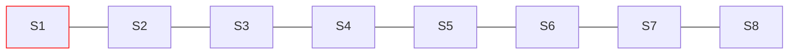
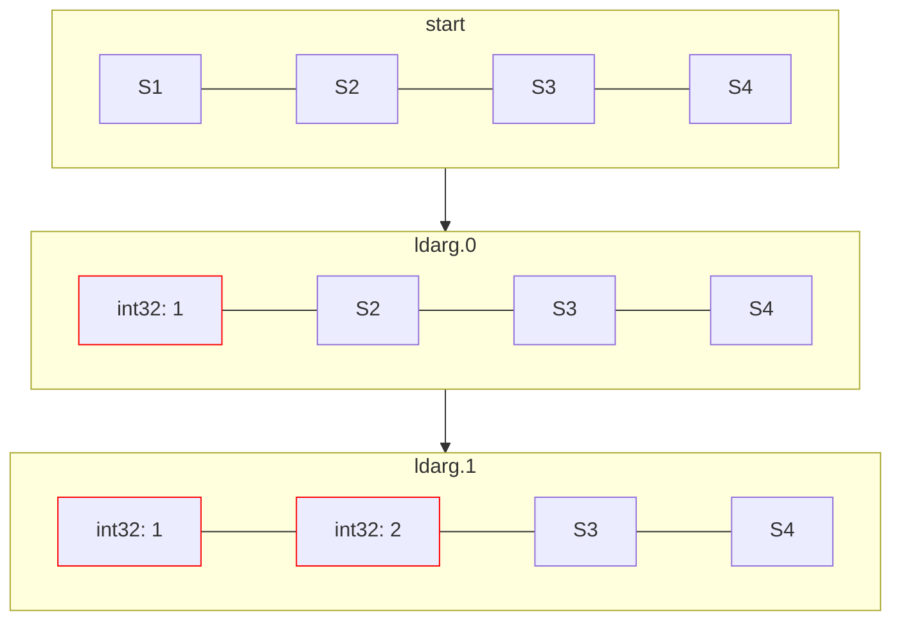
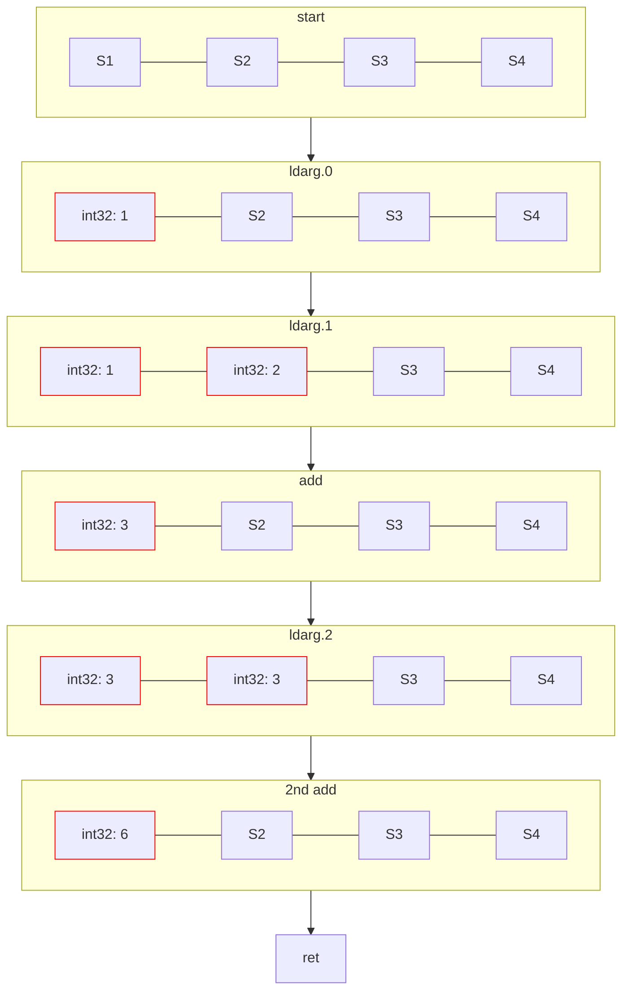

# IL

!!! info
    如果你在之前已经学习过 `IL` 并且使用过类 `System.Reflection.Emit` 这些 api 的话你可以跳过这一节.

## 简介

`IL` 全称 `Intermediate Language`, 在一些较老的文档里面它可能也会被叫做 `MSIL`, 即 `Microsoft Intermediate Language`.  
在前面我们就已经提到过 `IL` 了([阅读代码2](../begin/reading_2.md)), 但是并没有深入的讲解它到底是什么样的.  
`IL` 通常来说可以理解成两个部分, 一个 "执行" 部分, 一个 "声明" 部分, "执行" 部分规定了一个函数内部的代码应该怎么操控我们的程序,
而 "声明" 部分则规定了一个函数的返回值, 参数列表, 访问修饰符, 所在类, 类的访问修饰符, 名称等这些**元数据**, 获取这些元数据其实你早在学习**反射**的时候就进行过.
同时*修改或生成这些元数据*也不困难, 但是在进行蔚蓝 modding 时*修改或生成这些元数据*的操作几乎不会被使用到,
所以这一节我们聚焦于 `IL` 的 "执行" 部分, 讲述其基本结构, 基础语法等内容.  

## 初印象

```cs title="HelloWorld!"
namespace DynamicAssemblyTest;

public static class Program
{
    public static void Main()
    {
        Console.WriteLine("Hello world!");
    }
}
```
现在, 试着编译上述很简单的 HelloWorld 程序, 找到其程序集, 然后用 `dnSpy`(或者 `ILSpy` 也行) 打开它.  
不过这次我们不是在看 `C#` 代码了, 我们需要看 `IL` 代码, 所以我们在如下图的这个下拉框中选择 `IL`:


在图中的那一坨你可能不知所措的代码就是 `IL` 代码了, 在上述 `IL` 代码中 `.method` `.class` 这一类字样就表示声明一个 方法/类,
而其后面所跟的一大长串关键字就是一些元数据, 比如类名, 访问修饰符等我们之前谈论过的东西, 后面的大括号就表示这个声明的 "内容物",
通常类的 "内容物" 有内部类, 方法, 构造器, 字段, 属性等, 那么显而易见这里就毫无疑问就是 `IL` 的声明部分了.  
现在我们关注 `.method` 声明, 其的 "内容物" 就是我们接下来要聚焦的, 即 `IL` 的 "执行" 部分.
在上图中 dnSpy 帮我们将前面加上了字节内存偏移的那每一行就是我们的 `IL` 代码了,
不过这里我们不太会需要这个偏移量, 因为大多数涉及操作 `IL` 的库都会为我们自动完成这个偏移的计算.

## 切换环境 & 动态程序集

现在我们需要一个环境来书写我们的 `IL` 代码, 当然你虽然完全可以就在 dnSpy 对着那一大堆 `C#` 编译后的 `IL` 进行修改, 
并频繁保存修改然后运行来查看效果, 但是这总归没有我们直接在 `C#` 代码里写 `IL` 代码里方便!

首先, 我们现在可以不再在 mod 工程里工作了, 这部分内容是独立开来的, 所以我会推荐你新建一个项目来做这些.  
这里我给项目取的名是 `DynamicAssemblyTest`, 目标框架是 `.net 7`.  
完成后, 复制粘贴以下代码(之后我们会慢慢解释的):
```cs hl_lines="22-24"
using System.Reflection;
using System.Reflection.Emit;

namespace DynamicAssemblyTest;

public static class Program
{
    public static MethodInfo GenerateMethod(Action<ILGenerator> generateAction)
    {
        AssemblyBuilder asmBuilder = AssemblyBuilder.DefineDynamicAssembly(new("MyAssembly"), AssemblyBuilderAccess.RunAndCollect);
        ModuleBuilder moduleBuilder = asmBuilder.DefineDynamicModule("MyTestModule");
        TypeBuilder typeBuilder = moduleBuilder.DefineType("MyType");
        MethodBuilder methodBuilder = typeBuilder.DefineMethod("MyMethod", MethodAttributes.Public | MethodAttributes.Static);
        generateAction(methodBuilder.GetILGenerator());
        return typeBuilder.CreateType().GetMethod("MyMethod")!;
    }

    public static void Main()
    {
        MethodInfo methodInfo = GenerateMethod(il =>
        {
            il.Emit(OpCodes.Ldstr, "Hello Dynamic Method!");
            il.Emit(OpCodes.Call, typeof(Console).GetMethod("WriteLine", new Type[] { typeof(string) })!);
            il.Emit(OpCodes.Ret);
        });
        Action action = methodInfo.CreateDelegate<Action>();
        action();
    }
}
```
!!! note
    我默认启用了隐式命名空间, 如果你遇到了类型未找到的报错那你就得手动 using 一下剩余的那些命名空间了.

现在运行你的程序, 你应该会得到一句输出: `Hello Dynamic Method!`.  
上述代码其实是在在代码中动态定义了一个程序集, 然后动态定义了一个类, 并向里面动态定义了一个 `MyMethod` 方法,
之后我们动态地 "编译" 了这个程序集并将其装载到我们的程序集域中, 其中,
`MyMethod` 方法的 `IL` 的内容就是在我们的 `Main` 方法中 `GenerateMethod` 参数中的委托定义的.  
往简单来说就是我们在代码中反射创建了一段新的代码并执行, 这听起来是不是酷极了?(  

## 基本 `IL`

<!-- mkdocs 似乎没有为 IL 代码的高亮 -->
```c
IL_0000: nop
IL_0001: ldstr     "Hello world!"
IL_0006: call      void [System.Console]System.Console::WriteLine(string)
IL_000B: nop
IL_000C: ret
```

通常来说, 一段 `IL` 包含多行 `IL`, 每一行 `IL`(我偶尔也会称为一句 `IL`) 都包含一个**操作码(OpCode)**以及可以没有的参数.  
比如上述段 `IL`, 其包含五行 `IL`:

- 第一行 `IL` 的操作码是 `nop`, 没有参数
- 第二行 `IL` 的操作码是 `ldstr`, 参数是一串字符串, 或者严谨的说, 是一个字符串的 `token`, 它引用了程序集元数据中存放字符串本体的位置, 
不过我们可以忽略这个细节, 因为我们不会涉及到 `IL` 的具体字节层面的东西.
- 第三行 `IL` 的操作码是 `call`, 参数是一个方法, 它也是一个 `token`, 其也是引用了元数据中存放方法本体的位置
- 第四行 `IL` 的操作码是 `nop`, 没有参数
- 第五行 `IL` 的操作码是 `ret`, 没有参数

那么, 在知道 `IL` 的基本结构后, 我们就可以具体学习 `IL` 这些操作码到底干了什么了.

## 评估栈

!!! note
    如果你在这里不知道栈是什么的话, 你就该去复习一下你之前学习的数据结构之**栈**了.

在 `IL` 代码中, 大量操作符本质上都是在操作一个叫做 `评估栈` 的东西,
从字面上我们就可以知道它是一个栈, 那么既然是栈, 那么通常就有 `压入` 和 `弹出` 两种操作,
`评估栈` 也是如此.  
比如如下 `C#` 方法:
```cs
static int Add(int a, int b, int c) 
{
    return a + b + c;
}
```

它在编译器的 `Release` 优化下会编译成如下 `IL`:
!!! info
    编译器的 `Debug` 编译下会产生很多用于调试代码的 `IL`, 相对来说会复杂很多, 所以我们使用 `Release` 编译来尽可能简化

```c
.method private hidebysig static 
		int32 Add (
			int32 a,
			int32 b,
			int32 c
		) cil managed 
	{
		.maxstack 8

		IL_0000: ldarg.0
		IL_0001: ldarg.1
		IL_0002: add
		IL_0003: ldarg.2
		IL_0004: add
		IL_0005: ret
	} // end of method Program::Add
```

这里我们把一部分声明部分放出来了, 不过我们只需要关心这一行: `.maxstack 8`, 它表示请求在这个方法执行过程中评估栈有确保 8 个大小的空间可以使用.
用图表的方法大概是(最左侧栈高度最低, 向右栈高度逐渐增加, 红色表示目前使用了的栈位, 之后的图表同):

<center>

</center>

首先我们会介绍一个系列的操作符 `ldarg.*`, 它表示将方法参数列表中的第 *-1 个参数压入评估栈中, 不带参数(`ldarg.0` 与 `ldarg.1` 里的数字是操作符本身, 不要认为它是一个参数了), 
注意这是在静态方法中而言的,
如果该方法是成员方法, 那么 `ldarg.0` 实际上压入的是 `this` 的值, 而 `ldarg.1` 才是第一个参数.  


在上述段 `IL` 中, 该方法是个静态方法, 所以前两行 `ldarg.0` 与 `ldarg.1` 会将第一个参数和第二个参数压入评估栈中.  
现在假设我们调用传入的参数分别是 `1, 2, 3`(Sn表示未使用的栈位, a:b 表示该位置存入了一个a类型的b值, 后同):

<center>

</center>

然后要介绍的是 `add` 操作符, `add` 操作符会**弹出**评估栈上的两个元素, 然后将它们相加, 然后将结果**压入**评估栈.
当这两个元素任意一个不是基本数字类型时 jit 就会抛出 `InvalidProgramException` 异常.
同时注意一个细节, 你为类重载的加号运算符并**不是**使用的这个操作符, 而是调用的一个特殊的名为 `op_Add` 的带有 `special name` 标记的方法.  
最后是 `ret` 操作符, 当方法没有返回值时它会将控制权交回给调用者, 同时 jit 会为我们检查评估栈是否清空, 如果评估栈上还有东西那么同样 jit 会抛出异常.
当方法拥有返回值时它会确保评估栈上有且只剩一个元素, 然后将这个值弹出并压入调用者的评估栈上(评估栈是方法独立地).  
那么自然而然, 我们最初的那 6 句 `IL` 大概会是这个工作流程:

<center>

</center>

~~~这图做完后看上去好像不是想象中的那么直观...~~~

## 动手试试看

现在我们以及了解了一小些 `IL` 的知识, 现在我们回到之前的工程中, 更改为以下代码:
```cs hl_lines="14 23-28 30-32"

using System.Reflection;
using System.Reflection.Emit;

namespace DynamicAssemblyTest;

public static class Program
{
    public static MethodInfo GenerateMethod(Action<ILGenerator> generateAction)
    {
        AssemblyBuilder asmBuilder = AssemblyBuilder.DefineDynamicAssembly(new("MyAssembly"), AssemblyBuilderAccess.RunAndCollect);
        ModuleBuilder moduleBuilder = asmBuilder.DefineDynamicModule("MyTestModule");
        TypeBuilder typeBuilder = moduleBuilder.DefineType("MyType");
        MethodBuilder methodBuilder = typeBuilder.DefineMethod("MyMethod", MethodAttributes.Public | MethodAttributes.Static
            , typeof(int), new Type[] { typeof(int), typeof(int), typeof(int) });
        generateAction(methodBuilder.GetILGenerator());
        return typeBuilder.CreateType().GetMethod("MyMethod")!;
    }

    public static void Main()
    {
        MethodInfo methodInfo = GenerateMethod(il =>
        {
            il.Emit(OpCodes.Ldarg_0);
            il.Emit(OpCodes.Ldarg_1);
            il.Emit(OpCodes.Add);
            il.Emit(OpCodes.Ldarg_2);
            il.Emit(OpCodes.Add);
            il.Emit(OpCodes.Ret);
        });
        var func = methodInfo.CreateDelegate<Func<int, int, int, int>>();
        var result = func(1, 2, 3);
        Console.WriteLine($"result is {result}");
    }
}
```

这里我们在上面更改了方法的定义, 使它变为带有 `int` 返回值且接收 3 个参数的方法, 然后适当修改我们调用这个方法的地方,
然后运用我们刚才的 `IL` 知识实现这个方法.  

现在, 试着完成一个小练习, 将上面 `GenerateMethod` 方法里对 `MyMethod` 的实现从 `a + b + c` 更改为 `a + b * c`.

=== "提示"
    乘法的操作符为 `mul`, 其使用方法与 `add` 一致
=== "答案"
    === "方法一"
        ```cs
        il.Emit(OpCodes.Ldarg_1);
        il.Emit(OpCodes.Ldarg_2);
        il.Emit(OpCodes.Mul);
        il.Emit(OpCodes.Ldarg_0);
        il.Emit(OpCodes.Add);
        il.Emit(OpCodes.Ret);
        ```
    === "方法二"
        ```cs
        il.Emit(OpCodes.Ldarg_0);
        il.Emit(OpCodes.Ldarg_1);
        il.Emit(OpCodes.Ldarg_2);
        il.Emit(OpCodes.Mul);
        il.Emit(OpCodes.Add);
        il.Emit(OpCodes.Ret);
        ```
    === "解释"
        在方法一中我们的思路很自然, 先压入后两个参数使其相乘后再与第一个参数相加. 也就是实现的是 `(b * c) + a`.  
        在方法二中就需要动点脑子, 我们一次性将三个参数压入了栈中, 然后执行一个 `mul` 操作, 它会把最后压入的两个元素弹出相乘后压入,
        然后我们马上再执行一个 `add` 操作, 将刚刚被压入的元素与最开始被压入的第一个参数相加, 也就是实现的是 `a + (b * c)`.

现在你可以试着玩一些有趣的东西, 比如试着用 `ldarg.3` 压入一个不存在的第四个参数, 或者在 `ret` 时评估栈上没有元素或者有很多个元素.  
&emsp;———— 它们都会迷惑 jit 然后不知所措地扔给你一个 `InvalidProgramException`.

## 方法的调用, 字段、属性的访问

### 字段的访问

// TODO